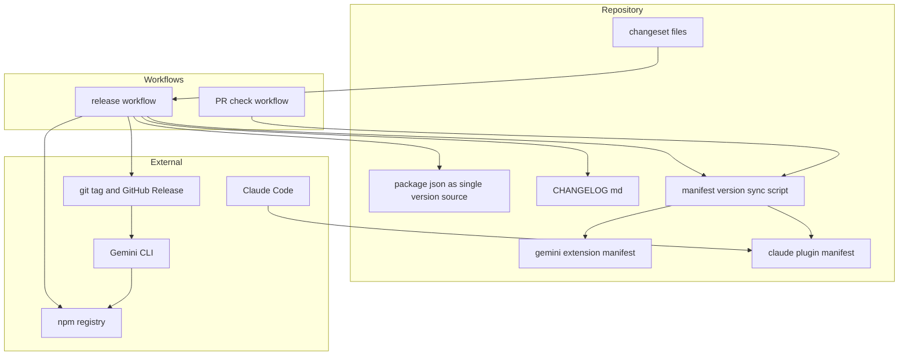
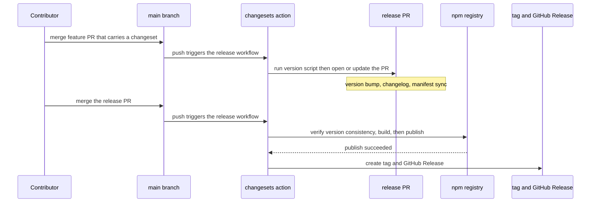
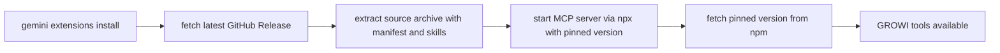
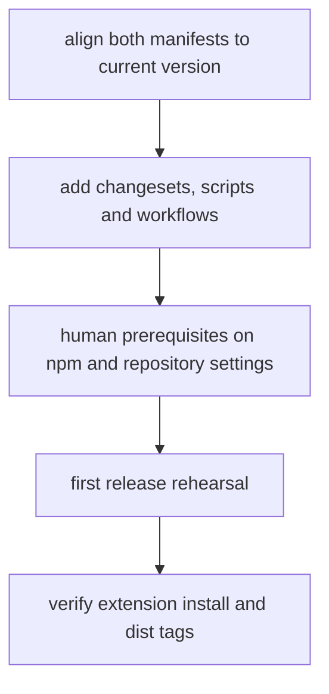

# Design Document

## Overview

**Purpose**: リリース作業を「変更意図を PR に残す → main にマージ → リリース用 PR を承認する」という再現可能な流れに置き換え、版上げ・変更履歴・npm 公開・tag・GitHub Release までを自動化する。あわせて配布物間のバージョン食い違いを構造的に防ぎ、Gemini CLI 拡張が導入直後に動作する状態にする。

**Users**: リリース担当メンテナ（作業の手数と取りこぼしが減る）、貢献者（変更と同時に影響区分と説明文を残せる）、各導入経路の利用者（同じバージョン番号が見え、Gemini CLI 拡張でも MCP サーバーが起動する）。

**Impact**: 現在このリポジトリには CI が 1 つも無く、版上げ・tag 付け・npm 公開はすべて手作業である。本設計はワークフロー 2 本と同期スクリプト 1 本を追加し、`package.json` を単一のバージョン源に定める。Gemini CLI 拡張の起動方式は `${extensionPath}/dist` 依存から npm 経由へ切り替える。

### Goals

- 変更意図（影響区分と説明文）を PR に残せば、その後の公開作業が Release PR の承認 1 回で完了する。
- `package.json` を単一のバージョン源とし、他の配布物の manifest がそこへ自動追従する。食い違いは公開前に検出して止める。
- 長期有効な公開用トークンをリポジトリに保管せずに npm 公開でき、公開物に provenance が付く。
- Gemini CLI 拡張が README の案内どおりのインストールで MCP サーバーを起動できる。
- 全 PR で lint とテストが走る。

### Non-Goals

- changeset の記録を PR チェックで強制しない（内部変更のみの PR では不要なため）。
- 過去バージョン（v1.0.0〜v1.7.0）の内容を `CHANGELOG.md` へ遡って収録しない。
- npm の `next` dist-tag（`1.0.0-RC.6`）に手を入れない。prerelease 運用（changesets の pre モード）も導入しない。
- Gemini CLI 拡張のオフライン起動と初回起動の高速化を追求しない。
- skills.sh 経由の配布にバージョンを導入しない。
- MCP ツールの機能追加・変更、および skills の内容変更。

### Boundary Commitments

**本 spec が所有するもの**

- `.changeset/` の設定、`package.json` のリリース関連スクリプトと `files`
- `.github/workflows/` のワークフロー 2 本（PR チェック / リリース）
- `gemini-extension.json` の `version` と MCP サーバー起動定義
- `.claude-plugin/plugin.json` の `version`
- バージョン同期スクリプトとその検査モード
- README（英語版・日本語版）のリリース手順の記述

**所有しないもの**

- MCP ツールの実装、`skills/` の内容、GROWI 接続のための環境変数の設計
- 既に公開済みの GitHub Release の本文、npm 上の既存バージョン
- skills.sh の配布方式

**許容する依存**

- `@changesets/cli` 2.x 系と `@changesets/changelog-github`、`changesets/action@v1`
- 既存の開発依存（`tsx`、Biome 1.9.4、Vitest）
- GitHub Actions、npm Trusted Publishing

**再検証が必要になる条件**

- `changesets/action` v2 と `@changesets/cli` v3 が GA になったとき（入力名が変わるため）
- npm の Trusted Publishing の要件（対応 npm の版・登録単位）が変わったとき
- Gemini CLI が拡張の取得経路や更新検知の方式を変えたとき
- `skills/` を独立した配布物として別バージョンで配る要求が出たとき
- 公開と tag / Release 作成の順序を変える変更を入れるとき（Gemini 拡張のバージョン固定が成立しなくなる）

## Requirements Traceability

| Requirement | Summary | Components | Interfaces | Flows |
|-------------|---------|------------|------------|-------|
| 1.1, 1.2 | 全 PR で lint とテストを実行し、失敗を失敗として報告 | PR Check Workflow | ワークフロー定義 | — |
| 1.3 | label 等の条件を付けず全 PR で実行 | PR Check Workflow | `on: pull_request` | — |
| 2.1 | 影響区分と説明文を PR に記録する手段 | Changesets Configuration | `.changeset/*.md` | リリースフロー |
| 2.2 | 記録が無ければ版上げもリリースもしない | Release Workflow | `changesets/action@v1` | リリースフロー |
| 2.3 | 説明文を変更履歴にそのまま反映 | Changesets Configuration | `changelog-github` | リリースフロー |
| 3.1 | 版上げと変更履歴を反映した Release PR | Release Workflow, Version Sync Script | `release:version` | リリースフロー |
| 3.2 | ビルドしてから npm に公開 | Release Workflow | `release:publish` | リリースフロー |
| 3.3 | `vX.Y.Z` の tag と GitHub Release | Release Workflow | `createGithubReleases` | リリースフロー |
| 3.4 | 長期トークンなしの公開と provenance | Release Workflow | ジョブ権限 `id-token: write` | リリースフロー |
| 3.5 | 公開の前提が未設定なら失敗として報告 | Release Workflow | ジョブの終了コード | リリースフロー |
| 3.6 | 公開物に変更履歴を含める | Package Manifest | `files` | — |
| 4.1, 4.2 | 変更履歴の追記と PR / コミット参照 | Changesets Configuration | `changelog-github` | リリースフロー |
| 4.3 | 過去分は遡らない | Changesets Configuration | 初回生成時の起点 | — |
| 5.1 | 2 つの manifest の version を追従 | Version Sync Script | `applyVersionToGeminiManifest`, `applyVersionToPluginManifest` | リリースフロー |
| 5.2 | 起動する MCP サーバーのバージョン指定も追従 | Version Sync Script | `applyVersionToGeminiManifest` | リリースフロー |
| 5.3 | 不一致を検出して公開を失敗させる | Version Sync Script, PR Check Workflow, Release Workflow | `collectVersionViolations`, `--check` | リリースフロー |
| 5.4 | バージョン以外の記述を変更しない | Version Sync Script | 純粋変換関数 | — |
| 6.1, 6.2 | 拡張のインストール後に MCP サーバーが起動、`dist` 前提を廃止 | Gemini Extension Manifest | `mcpServers` 定義 | 拡張起動フロー |
| 6.3 | 表示バージョンと起動するサーバーのバージョンが一致 | Gemini Extension Manifest, Version Sync Script | `applyVersionToGeminiManifest` | 拡張起動フロー |
| 6.4 | 既存の環境変数による設定方法を維持 | Gemini Extension Manifest | `settings` | 拡張起動フロー |
| 7.1, 7.2 | 手順と前提設定を英日 README に記載 | Repository Documentation | README の Contributing 節 | — |
| 8.1 | tag 形式の維持と 1.7.0 の後続からの再開 | Release Workflow | changesets の単一パッケージ規約 | リリースフロー |
| 8.2, 8.3 | `next` dist-tag に触らず `latest` のみ | Release Workflow | `changeset publish` の既定 | — |
| 8.4 | 既存の導入方法の手順を変えない | Package Manifest, Gemini Extension Manifest | `bin`, `mcpServers` | 拡張起動フロー |

## Architecture

### Existing Architecture Analysis

- **CI が存在しない**: `.github/` ディレクトリ自体が無い。したがって既存ワークフローとの整合を取る必要がなく、命名と権限を最初から決められる。
- **ビルドは ncc による単一ファイル出力**: `pnpm build` が `dist/index.js` を作る。`dist/` は git 管理外で、公開物にのみ含まれる。
- **単体スクリプトは `tsx` 実行**: `scripts/growi-healthchecker.ts` を `tsx` で起動する形が既にある。同期スクリプトもこれに合わせる。
- **バージョンが 3 か所に分散**: `package.json`（1.7.0）、`gemini-extension.json`（1.2.0）、`.claude-plugin/plugin.json`（1.0.0）。後者 2 つは追加時から更新されていない。
- **維持すべき結合点**: `bin` による `npx @growi/mcp-server` の直接利用、`skills/` を読む skills.sh と Claude Code プラグイン、`settings` に並ぶ GROWI 接続用の環境変数名。

### Boundary Map



**Architecture Integration**

- **選択した構成**: バージョン源を `package.json` の 1 か所に定め、他の manifest は版上げ手順の中で派生させる。派生の正しさは検査コマンドで守る。
- **責務の分離**: ワークフローは「いつ何を走らせるか」だけを持ち、判断と書き換えは `package.json` のスクリプトと同期スクリプトに置く。これによりローカルでも同じ手順を再現できる。
- **維持する既存パターン**: `tsx` による単体スクリプト実行、Biome による整形、Vitest の co-locate テスト（`*.test.ts`）。
- **新規要素の理由**: 同期スクリプトは changesets が `package.json` しか書き換えないという制約を埋めるために必要。ワークフロー 2 本は現状ゼロからの新設。

### Technology Stack

| Layer | Choice / Version | Role in Feature | Notes |
|-------|------------------|-----------------|-------|
| リリース管理 | `@changesets/cli` ^2.31.1 | 変更意図の記録、版上げ、変更履歴生成、npm 公開 | v3 は prerelease のため 2.x 系を採る |
| 変更履歴生成 | `@changesets/changelog-github` ^0.7.0 | PR / コミット参照付きの変更履歴 | `repo` に `growilabs/growi-mcp-server` を指定 |
| CI / 自動化 | `changesets/action@v1`（v1.9.0） | Release PR の作成・更新、公開、tag と GitHub Release 作成 | v2 は prerelease。入力名は v1 の `version` / `publish` |
| CI ランタイム | Node 24 / pnpm 10.11.0 | ワークフローの実行環境 | OIDC 公開に対応した npm を同梱する版。利用者側の `engines`（Node 18+）とは別 |
| スクリプト実行 | `tsx` ^4.20.4（既存） | 同期スクリプトの実行 | 既存 `scripts/` の慣習に合わせる |
| テスト | Vitest ^3.2.4（既存） | 同期スクリプトの単体テスト | co-locate した `*.test.ts` |
| 公開認証 | npm Trusted Publishing（OIDC） | 長期トークンなしの公開と provenance 付与 | ジョブ権限 `id-token: write` が必要 |

## System Flows

### リリースフロー



**流れに関する決定**

- ワークフローの起動条件は 1 つ（main への push）で、changeset が残っているかどうかで「Release PR を作る」か「公開する」かが分岐する。分岐の判断は action が持つ。
- 検査 → ビルド → 公開の順序を公開スクリプト側で固定する。検査で落ちれば公開に進まない（3.5、5.3）。
- tag と GitHub Release は公開成功後に作られる。この順序により、Gemini 拡張が Release tag 経由で配布される時点では npm 上に同じバージョンが存在する（6.3 の前提）。
- 同時実行を防ぐため、ワークフローに `concurrency` を設定して直列化する。

### Gemini CLI 拡張の起動フロー



**流れに関する決定**

- 拡張のアーカイブには `dist/` が含まれないという前提を受け入れ、MCP サーバーの実体は npm から取得する。これにより「アーカイブに成果物を同梱する」責務をリリースフローから外す。
- 起動コマンドの作業ディレクトリ指定（`cwd`）を外す。拡張の展開先には `@growi/mcp-server` という名前の `package.json` が置かれるため、そこを作業ディレクトリにすると同名のローカルパッケージと紛れる余地が生じる。作業ディレクトリを指定しないことでこの曖昧さを消す。

## Components and Interfaces

| Component | Domain/Layer | Intent | Req Coverage | Key Dependencies (P0/P1) | Contracts |
|-----------|--------------|--------|--------------|--------------------------|-----------|
| Changesets Configuration | リリース管理 | 変更意図の記録形式と変更履歴の生成方式を定める | 2.1, 2.3, 4.1, 4.2, 4.3 | `@changesets/cli` (P0), `@changesets/changelog-github` (P0) | Batch |
| Version Sync Script | リリース管理 | `package.json` のバージョンを他の manifest へ派生させ、食い違いを検査する | 5.1, 5.2, 5.3, 5.4, 6.3 | `tsx` (P0) | Service, Batch |
| Release Workflow | CI | Release PR の作成・更新と、公開・tag・Release 作成を実行する | 3.1〜3.6, 2.2, 8.1, 8.2, 8.3 | `changesets/action@v1` (P0), npm Trusted Publishing (P0) | Batch |
| PR Check Workflow | CI | 全 PR で lint・テスト・バージョン整合を検査する | 1.1, 1.2, 1.3, 5.3 | Biome (P0), Vitest (P0) | Batch |
| Gemini Extension Manifest | 配布物 | 拡張の表示バージョンと MCP サーバー起動方法を定める | 6.1, 6.2, 6.3, 6.4, 8.4 | npm registry (P0) | State |
| Package Manifest | 配布物 | 単一のバージョン源、公開物の範囲、リリース用スクリプト | 3.2, 3.6, 8.1, 8.4 | — | State |
| Repository Documentation | 文書 | 記録方法・2 段の流れ・前提設定を英日 README に記載 | 7.1, 7.2 | — | — |

### リリース管理

#### Version Sync Script

| Field | Detail |
|-------|--------|
| Intent | `package.json` のバージョンを他の manifest へ派生させ、食い違いを検査する |
| Requirements | 5.1, 5.2, 5.3, 5.4, 6.3 |

**Responsibilities & Constraints**

- `package.json` の `version` を唯一の入力とし、`gemini-extension.json` と `.claude-plugin/plugin.json` を更新する。
- `gemini-extension.json` では `version` と、MCP サーバー起動引数に含まれるパッケージのバージョン指定の 2 か所を更新する。
- バージョン以外のキー・値・引数の構成を変更しない（5.4）。整形は Biome に委ね、スクリプトは意味のある差分だけを作る。
- 検査モードでは書き換えを行わず、違反の一覧を返して非ゼロ終了する。
- 書き換え対象の判定と値の組み立ては純粋関数に置き、ファイル読み書きと終了コードの決定だけを薄い CLI 層に残す。

**Dependencies**

- Inbound: `release:version` スクリプト — 版上げ直後の派生（P0）
- Inbound: PR Check Workflow / `release:publish` スクリプト — 検査（P0）
- External: `tsx` — TypeScript の直接実行（P0）

**Contracts**: Service [x] / API [ ] / Event [ ] / Batch [x] / State [ ]

##### Service Interface

実装は下記の中核となる変換・検査関数に加え、CLI 層（ファイル読み書きと終了コードの決定）が使う補助関数（起動引数の書き換え単体、バージョン抽出、違反メッセージの整形）も export する。補助関数のシグネチャは実装（`scripts/sync-manifest-versions.ts`）を正とし、ここでは一覧として挙げるに留める。

```typescript
const PACKAGE_NAME = '@growi/mcp-server';

type McpServerEntry = {
  readonly command: string;
  readonly args: readonly string[];
  readonly [key: string]: unknown;
};

type GeminiExtensionManifest = {
  readonly name: string;
  readonly version: string;
  readonly mcpServers: Readonly<Record<string, McpServerEntry>>;
  readonly [key: string]: unknown;
};

type ClaudePluginManifest = {
  readonly name: string;
  readonly version: string;
  readonly [key: string]: unknown;
};

type VersionViolation = {
  readonly file: string;
  readonly location: string;
  readonly found: string;
  readonly expected: string;
};

// Core transform and check functions.
export const applyVersionToGeminiManifest: (
  manifest: GeminiExtensionManifest,
  version: string,
) => GeminiExtensionManifest;

export const applyVersionToPluginManifest: (
  manifest: ClaudePluginManifest,
  version: string,
) => ClaudePluginManifest;

export const collectVersionViolations: (
  input: {
    readonly gemini: GeminiExtensionManifest;
    readonly plugin: ClaudePluginManifest;
  },
  version: string,
) => readonly VersionViolation[];

// Auxiliary exports used by the CLI layer and by tests.
export const applyVersionToLaunchArgs: (
  args: readonly string[],
  version: string,
) => readonly string[];

export const formatViolation: (violation: VersionViolation) => string;

export const extractPackageVersion: (
  packageManifest: Readonly<Record<string, unknown>>,
) => string;
```

- Preconditions: `version` は `package.json` から読んだ空でない文字列。両 manifest は JSON として読める。
- Postconditions: 変換関数は入力を書き換えず新しい値を返す。`version` と対象の起動引数以外は入力と等しい。
- Invariants: `collectVersionViolations` が空配列を返す状態と、変換関数を適用しても差分が出ない状態は一致する。

##### Batch / Job Contract

- Trigger: `release:version`（書き換え）、PR Check Workflow と `release:publish`（`--check` による検査）
- Input / validation: `package.json` の `version`。読み取れない・空である場合は失敗させる。
- Output / destination: 書き換えモードは 2 つの manifest ファイル。検査モードは違反一覧の標準出力と非ゼロ終了コード。
- Idempotency & recovery: 同じバージョンで何度実行しても結果は同じ。失敗しても部分的な書き換えを残さないよう、両 manifest の変換をすべて済ませてから書き出す。

**Implementation Notes**

- Integration: 起動引数のバージョン指定は、引数がパッケージ名と完全一致する場合（バージョン指定なし。導入時の初期状態）か、パッケージ名の直後にバージョン区切りが続く場合のみを対象に置き換える。単純な前方一致にしないのは、将来 `@growi/mcp-server-cli` のような別パッケージを引数に置いたときに黙って書き換えてしまうことを避けるため。
- Validation: 検査の出力には対象ファイル名・場所（`version` か起動引数か）・実際の値・期待値を含める。機微情報は扱わない。
- Risks: 起動引数の構成を将来変える場合、置換対象の判定条件を合わせて見直す必要がある。

#### Changesets Configuration

| Field | Detail |
|-------|--------|
| Intent | 変更意図の記録形式と変更履歴の生成方式を定める |
| Requirements | 2.1, 2.3, 4.1, 4.2, 4.3 |

**Responsibilities & Constraints**

- 変更意図は `.changeset/` 配下の Markdown として PR に含める。影響区分（patch / minor / major）と説明文を持つ。
- 変更履歴は `@changesets/changelog-github` で生成し、各項目に PR とコミットへの参照を含める（4.2）。
- 版上げ時に自動コミットさせない（`commit: false`）。コミットは action 側が行う。
- 公開範囲は public、基準ブランチは `main`。
- prerelease 運用（pre モード）と snapshot 公開は設定しない（Non-Goals）。
- `CHANGELOG.md` は初回リリース時に生成される。過去バージョンを遡って書かない（4.3）。

**Contracts**: Batch [x]

- Trigger: 貢献者による `.changeset/*.md` の追加
- Input / validation: 影響区分とパッケージ名。記録が無い場合は版上げ対象が存在しない状態として扱う（2.2）。

### CI

#### Release Workflow

| Field | Detail |
|-------|--------|
| Intent | Release PR の作成・更新と、公開・tag・GitHub Release の作成 |
| Requirements | 2.2, 3.1〜3.6, 8.1, 8.2, 8.3 |

**Responsibilities & Constraints**

- 起動条件は main への push と手動実行。`concurrency` で直列化する。
- ジョブ権限は `contents: write`（版上げコミットと tag）、`pull-requests: write`（Release PR）、`id-token: write`（OIDC 公開）の 3 つに限る。
- 版上げは `release:version`、公開は `release:publish` に委ね、ワークフローは呼び出しだけを持つ。
- tag と GitHub Release の作成は action の既定機能を使う（単一パッケージのため tag は `vX.Y.Z` 形式になる。8.1）。
- 公開先の dist-tag は `changeset publish` の既定（`latest`）に任せ、他の dist-tag を指定しない（8.2、8.3）。
- **ファイル名は `release.yml` に固定する。** npm の Trusted Publisher 登録がワークフローのファイル名に紐づくため、改名は公開の失敗に直結する。

**Dependencies**

- External: `changesets/action@v1` — Release PR と公開の制御（P0）
- External: npm Trusted Publishing — 公開の認証（P0）
- Inbound: Version Sync Script — 公開前の整合検査（P0）

**Contracts**: Batch [x]

- Trigger: `push` (main) / `workflow_dispatch`
- Input / validation: `.changeset/` に記録があるか。無ければ何もしない（2.2）。
- Output / destination: Release PR、npm 上の新バージョン、tag、GitHub Release
- Idempotency & recovery: 同じ内容の main に対して再実行しても、Release PR は更新されるだけで重複しない。npm への公開自体が失敗した場合は tag も Release も作られないため、原因を直して再実行すれば復旧する。ただし npm への公開が成功した後で tag push や GitHub Release 作成だけが失敗した場合は、再実行では復旧しない（`changeset publish` が「公開すべきものが無い」と判断し、Release 作成をやり直さないため）。この場合は `gh release create vX.Y.Z` による手動作成が必要になる（詳細は Error Handling を参照）。

**Implementation Notes**

- Integration: 依存のインストールは lockfile 固定で行う（`--frozen-lockfile`）。Node 24 を使う理由は OIDC 公開に対応した npm を同梱する版であること。
- Validation: 公開の前提（npm の Trusted Publisher 登録、リポジトリ設定の PR 作成許可）が未整備なら、ジョブの失敗として現れる（3.5）。ワークフローから設定不足を判定して案内する手段はないため、文書で先回りする。
- Risks: 権限や設定の不足はジョブのエラーメッセージからしか分からない。初回リリースはリハーサルとして扱う（Migration Strategy）。

#### PR Check Workflow

| Field | Detail |
|-------|--------|
| Intent | 全 PR で lint・テスト・バージョン整合を検査する |
| Requirements | 1.1, 1.2, 1.3, 5.3 |

**Responsibilities & Constraints**

- `pull_request` で起動し、label・タイトル・変更ファイルによる条件を付けない（1.3）。
- 実行するのは `pnpm lint`、`pnpm test`、バージョン整合の検査の 3 つ。いずれかが失敗すればジョブを失敗させる（1.2）。
- ジョブ権限は読み取りのみとする。
- changeset の有無は検査しない（Non-Goals）。

**Contracts**: Batch [x]

- Trigger: `pull_request`（作成・更新・再オープン）
- Output / destination: PR のチェック結果

### 配布物

#### Gemini Extension Manifest

| Field | Detail |
|-------|--------|
| Intent | 拡張の表示バージョンと MCP サーバーの起動方法を定める |
| Requirements | 6.1, 6.2, 6.3, 6.4, 8.4 |

**Responsibilities & Constraints**

- MCP サーバーの起動は npm 経由とし、バージョンを固定して指定する。`${extensionPath}/dist` を参照しない（6.2）。
- 作業ディレクトリ指定（`cwd`）を持たない（同名のローカルパッケージと紛れる余地を消すため）。
- `settings` に並ぶ GROWI 接続用の環境変数名と役割は変更しない（6.4）。
- `version` は同期スクリプトが `package.json` に合わせる（6.3）。

**Contracts**: State [x]

- State model: `version` と起動引数のバージョン指定。両者は常に `package.json` と一致する。
- Persistence & consistency: 一致は版上げ手順で作られ、検査コマンドで守られる。

**Implementation Notes**

- Integration: 起動定義は「コマンドに npm の実行ラッパー、引数に確認省略フラグとバージョン固定のパッケージ指定」の形にする。

  ```json
  {
    "mcpServers": {
      "growi": {
        "command": "npx",
        "args": ["-y", "@growi/mcp-server@1.7.0"]
      }
    }
  }
  ```

- Validation: 拡張のインストールと MCP サーバー起動の確認は、初回リリース後の手動確認で行う（Testing Strategy）。
- Risks: 初回起動時に npm からの取得が入るため待ち時間が生じる。オフラインでは起動しない。いずれも要件から除外済み。

#### Package Manifest

| Field | Detail |
|-------|--------|
| Intent | 単一のバージョン源、公開物の範囲、リリース用スクリプトを持つ |
| Requirements | 3.2, 3.6, 8.1, 8.4 |

**Responsibilities & Constraints**

- `version` を唯一のバージョン源とする。
- `files` に `CHANGELOG.md` を追加する（3.6）。`dist`・`README.md`・`LICENSE` は現状のまま。
- `bin` の定義を変更しない（`npx @growi/mcp-server` による直接利用を維持。8.4）。
- リリース用スクリプトは次の 4 つとし、ワークフローからも手元からも同じ手順を呼べるようにする。

  | Script | 役割 |
  |--------|------|
  | `sync:versions` | `package.json` から各 manifest へバージョンを派生させる |
  | `sync:versions:check` | 派生結果の食い違いを検査する（非ゼロ終了で失敗） |
  | `release:version` | 版上げ → バージョン派生 → 変更した JSON の整形 |
  | `release:publish` | 整合検査 → ビルド → 公開 |

**Contracts**: State [x]

**Implementation Notes**

- Integration: `release:version` の整形は Biome に委ねる（changesets と同期スクリプトの出力をリポジトリの整形規約に合わせる）。対象は書き換えた JSON のみ。
- Risks: スクリプト名を変えるとワークフローの呼び出しと文書が食い違う。名前は本設計で固定する。

### 文書

#### Repository Documentation

| Field | Detail |
|-------|--------|
| Intent | 記録方法・2 段の流れ・前提設定を英日 README に記載する |
| Requirements | 7.1, 7.2 |

**Responsibilities & Constraints**

- 記載場所は既存の Contributing 節（英語版 `### Contributing` / 日本語版 `### コントリビューション`）とし、両方に同じ導線を置く（7.2）。
- 記載する内容は 3 つ。(1) 利用者に影響する変更を含む PR には変更意図を記録すること、(2) main へのマージで Release PR が作られ、その PR のマージで公開されること、(3) 公開に必要な前提設定（npm の Trusted Publisher 登録、リポジトリ設定の PR 作成許可）。
- 前提設定は人間が行う作業であることを明記する。

## File Structure Plan

| Path | 新規 / 変更 | 責務 |
|------|-------------|------|
| `.changeset/config.json` | 新規 | 変更履歴の生成方式、基準ブランチ、公開範囲の設定 |
| `.changeset/README.md` | 新規 | changesets の使い方（初期化で生成される定型文） |
| `scripts/sync-manifest-versions.ts` | 新規 | バージョン派生の純粋変換と、読み書き・終了コードを担う薄い CLI 層 |
| `scripts/sync-manifest-versions.test.ts` | 新規 | 上記の純粋変換と検査の単体テスト |
| `vitest.config.ts` | 変更 | テスト対象に `scripts/` 配下を追加する（現状は `src/` 限定で、リリース基盤のテストが実行されない） |
| 既存の整形違反があるファイル群 | 変更 | 新設する PR チェックが初日から失敗しないよう、整形のみを適用する（対象は `package.json`、`.claude-plugin/*.json`、`.kiro/settings/templates/specs/init.json`、`src/tools/aiTools/suggestPath/` の 2 ファイル） |
| `.github/workflows/ci.yml` | 新規 | 全 PR での lint・テスト・整合検査 |
| `.github/workflows/release.yml` | 新規 | Release PR の作成・更新、公開、tag と Release 作成（**ファイル名固定**） |
| `package.json` | 変更 | 開発依存 2 件の追加、リリース用スクリプト 4 件の追加、`files` への `CHANGELOG.md` 追加 |
| `gemini-extension.json` | 変更 | `version` を 1.7.0 に、起動定義を npm 経由に、`cwd` を削除 |
| `.claude-plugin/plugin.json` | 変更 | `version` を 1.7.0 に |
| `README.md` | 変更 | Contributing 節にリリース手順と前提設定 |
| `README_JP.md` | 変更 | 同上（日本語版） |
| `CHANGELOG.md` | 生成物 | 初回リリース時に changesets が作る。実装では作らない |

## Error Handling

### Error Strategy

失敗は「気づける形で止める」ことを優先する。握りつぶして先に進める経路を作らない。

### Error Categories and Responses

- **設定不足（前提作業の未実施）**: npm の Trusted Publisher 未登録、リポジトリ設定の PR 作成許可が無効。いずれもジョブの失敗として現れる。ワークフロー側で判定して案内することはできないため、文書で先回りする（7.1）。この場合は npm への公開自体が起きないため、tag と GitHub Release も作られない（3.5）。
- **公開成功後の Release 作成失敗**: npm への公開自体は成功したが、その後の tag push または GitHub Release 作成だけが失敗するケース。ワークフローを再実行しても復旧しない。`changeset publish` は「公開すべき変更が残っていない」と判断し、Release 作成をやり直さないため。この場合は `gh release create vX.Y.Z` で該当バージョンの GitHub Release を手動作成する（本文には `CHANGELOG.md` の該当節を使う）。Gemini CLI 拡張は GitHub Release 経由で配布されるため、これを行わないと npm 側は公開済みでも拡張の更新が利用者に届かない。
- **バージョンの食い違い**: 検査モードが違反一覧（ファイル名・場所・実際の値・期待値）を出力して非ゼロ終了する。PR チェックでは PR の失敗として、公開前ではビルドと公開に進まない形で現れる（5.3）。
- **入力の不備**: `package.json` の `version` が読めない・空である場合は、その場で失敗させる（既定値で代替しない）。
- **同時実行**: `concurrency` により後続の実行が待つか打ち切られる。中途半端な Release PR が並行して作られる状態を避ける。

### Monitoring

GitHub Actions の実行結果を唯一の観測点とする。専用の監視は導入しない。

## Testing Strategy

### Unit Tests

対象は同期スクリプトの純粋変換と検査（co-locate した `scripts/sync-manifest-versions.test.ts`）。

1. `gemini-extension.json` の `version` と起動引数のバージョン指定が、同じバージョンへ同時に更新される（5.1、5.2、6.3）
2. 起動引数の他の要素（確認省略フラグ）と他のキー（`name`・`description`・`settings`）が変更されない（5.4、6.4）
3. `.claude-plugin/plugin.json` の `version` が更新され、他のキーが変更されない（5.1、5.4）
4. 検査モードが、一致状態では違反ゼロを返し、不一致状態ではファイル名・場所・実際の値・期待値を含む違反を返す（5.3）
5. バージョン指定が付いていない起動引数（`@growi/mcp-server`）にもバージョンが付与される（導入時の初期状態を扱えること）

### Integration Tests

ワークフロー自体は GitHub Actions 上でしか実行できないため、初回リリースをリハーサルとして扱い、次を実測で確認する。

1. changeset を含む PR を main にマージすると Release PR が作られ、その差分に版上げ・変更履歴・2 つの manifest の同期が含まれる（3.1、5.1、5.2）
2. Release PR のマージで npm に公開され、`vX.Y.Z` の tag と GitHub Release が作られる（3.2、3.3、8.1）
3. 公開物に provenance が付き、リポジトリに長期トークンが無い状態で成立している（3.4）
4. 公開されたパッケージに `CHANGELOG.md` が含まれる（3.6）
5. changeset を含まない変更のみを main にマージしたとき、Release PR も公開も発生しない（2.2）

### Manual Verification

1. `gemini extensions install` で拡張を導入し、MCP サーバーが起動して GROWI ツールが使えることを確認する（6.1、6.2）
2. 拡張の表示バージョンと、起動したサーバーのバージョンが一致することを確認する（6.3）
3. npm の `next` dist-tag が `1.0.0-RC.6` のまま変わっていないことを確認する（8.2、8.3）

### Out of Scope

ワークフロー YAML の構文・挙動を対象にした自動テストは設けない。GitHub Actions 上の実行結果で確認する。

## Security Considerations

- 公開に長期有効なトークンを使わない。ジョブ権限に `id-token: write` を与え、npm 側の Trusted Publisher 登録で認証する。リポジトリに公開用の secret を保管しない（3.4）。
- ジョブ権限は用途ごとに最小化する。PR チェックは読み取りのみ、リリースは上記 3 権限に限る。
- 検査コマンドの出力にはバージョン番号とファイル名しか含めない。機微情報を扱う経路を持たない。
- 公開物に provenance を付けることで、利用者が「どのリポジトリのどのワークフローが作ったか」を検証できる。

## Migration Strategy



- **段階 1**: 2 つの manifest を現行バージョン（1.7.0）に揃える。検査を導入した直後から意味を持つ状態にするための 1 回だけの作業。
- **段階 2**: 設定・スクリプト・ワークフローを追加する。この時点では公開は起きない（changeset が無いため）。
- **段階 3**: 人間による前提作業。npm 側の Trusted Publisher 登録（リポジトリと `release.yml`）と、リポジトリ設定の PR 作成許可の有効化。
- **段階 4**: 最初の changeset を入れて Release PR の内容を確認し、マージして公開まで通す。切替後の最初の公開は 1.7.0 の後続バージョンになる（8.1）。
- **段階 5**: Gemini 拡張のインストール確認と、`next` dist-tag が変わっていないことの確認。
- **切り戻しの条件**: 段階 4 で公開が失敗し原因が前提設定でない場合は、ワークフローを無効化して従来の手動公開に戻せる。`package.json` の `version` と tag 形式は従来と同じ形を保つため、切り戻しても利用者側への影響はない。
