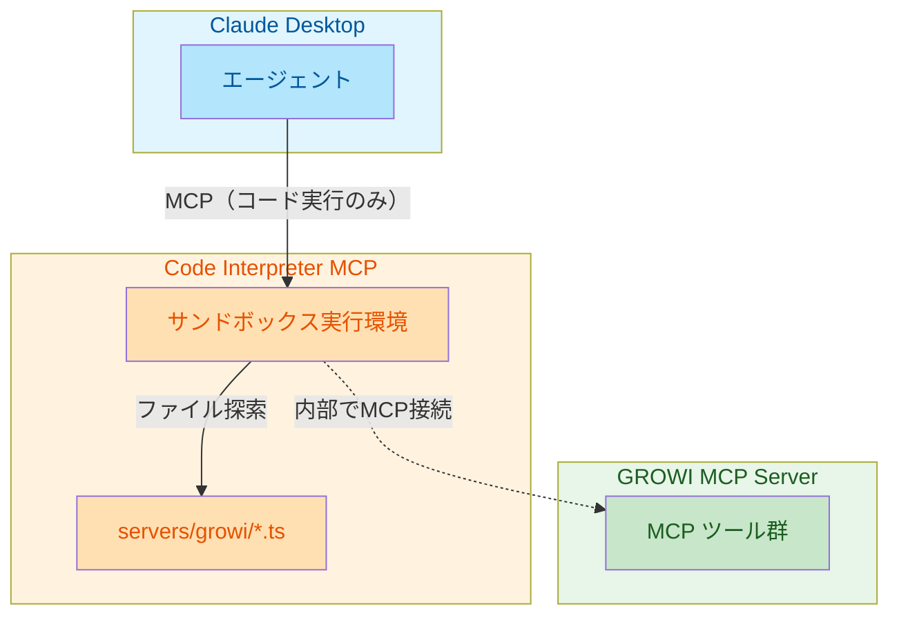
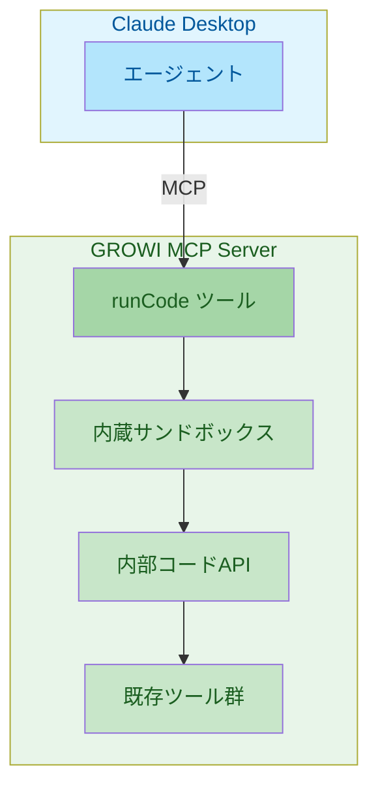

# コード実行アプローチ比較 - 分離型 vs 統合型

## 概要

Anthropic 提唱の「Code execution with MCP」を GROWI MCP Server に導入するにあたり、2つのアプローチが考えられる。本ドキュメントでは両者を比較し、採用判断の材料を提供する。

---

## Anthropic 提唱アプローチの核心

**重要:** Anthropic 提唱のコード実行アプローチでは、ツール発見に MCP の `tools/list` を使用しない。

### 従来の MCP アプローチ

```text
1. MCP クライアントが tools/list を呼び出し
2. 全ツール定義（名前・説明・パラメータスキーマ）がコンテキストに読み込まれる
3. エージェントが必要なツールを選んで呼び出し
```

→ ツール数が増えるとトークン消費が増大

### Anthropic 提唱アプローチ

```text
1. エージェントがファイルシステムを探索（./servers/ ディレクトリ）
2. 必要なツールファイル（*.ts）だけを読み込む
3. コードを書いてツールを呼び出し
```

→ 必要なツール定義だけがコンテキストに入る（98.7% のトークン削減）

---

## アプローチ概要

### 分離型（Separated Approach）

外部の Code Interpreter MCP サーバーを導入し、その内部から GROWI MCP Server に接続する。



**ポイント:** Claude Desktop は GROWI MCP に直接接続しない。Code Interpreter 内部で接続する。

### 統合型（Integrated Approach）

GROWI MCP Server 自体にコード実行機能（`runCode` ツール）を組み込む。



---

## 比較表

| 観点 | 分離型 | 統合型 |
|------|--------|--------|
| **ツール定義のトークン** | 同等（ファイル探索で必要分のみ） | 同等（ファイル探索で必要分のみ） |
| **ユーザーセットアップ** | 2つのMCPサーバー設定が必要 | GROWI MCP のみで完結 |
| **汎用性** | 他のMCPサーバーにも使える | GROWI 専用 |
| **保守範囲** | コード実行は外部に依存 | サンドボックスも自前で保守 |
| **実行時オーバーヘッド** | MCP プロトコル経由（stdio/SSE） | 直接関数呼び出し（高速） |
| **セキュリティ実装** | 外部実装を利用 | 自前で実装が必要 |
| **依存関係** | 外部MCP + 生成コード配置 | 内部で完結 |
| **開発工数** | 生成スクリプト + client.ts | 生成スクリプト + サンドボックス |

**注:** 両アプローチとも、ツール発見はファイルシステム探索で行うため、MCP `tools/list` による全ツール定義のロードは発生しない。

---

## 分離型の詳細

### メリット

1. **関心の分離**
   - GROWI MCP は API 提供に専念
   - コード実行環境は専門のMCPサーバーに委譲
   - 各コンポーネントの責務が明確

2. **既存実装の活用**
   - [mcp-server-code-execution-mode](https://github.com/elusznik/mcp-server-code-execution-mode)
   - [E2B MCP Server](https://github.com/e2b-dev/mcp-server)
   - セキュリティ対策済みの実装を利用可能

3. **汎用的な構成**
   - 同じ Code Interpreter で他の MCP サーバーも利用可能
   - 将来的な拡張性が高い

4. **保守コストの軽減**
   - サンドボックスの脆弱性対応は外部に依存
   - GROWI MCP チームはビジネスロジックに集中

### デメリット

1. **ユーザー体験の複雑化**
   - 2つの MCP サーバーを設定する必要がある
   - 初期セットアップのハードルが上がる

2. **実行時のオーバーヘッド**
   - 生成コード → GROWI MCP への呼び出しが MCP プロトコル経由
   - stdio/SSE 通信によるレイテンシ（ただしトークン消費には影響しない）

3. **外部依存のリスク**
   - Code Interpreter MCP の開発停止リスク
   - バージョン互換性の管理が必要

4. **配置の複雑さ**
   - 生成コードAPI の配置場所を調整する必要
   - Code Interpreter の作業ディレクトリとの連携

### 実装タスクへの影響

```
Story 1: Code Interpreter MCP の選定・導入（外部依存）
Story 2:
  - client.ts（MCP クライアント）の実装が必要
  - 生成コードは外部ディレクトリに配置
  - MCP 接続設定の管理
```

---

## 統合型の詳細

### メリット

1. **シンプルなユーザー体験**
   - GROWI MCP をインストールするだけで完結
   - 追加の MCP サーバー設定不要

2. **高速な実行**
   - 直接関数呼び出し（MCP オーバーヘッドなし）
   - 同一プロセス内で完結

3. **一貫した開発体験**
   - GROWI MCP リポジトリ内で完結
   - バージョン管理が容易

4. **カスタマイズの自由度**
   - GROWI 固有の最適化が可能
   - サンドボックス設定を細かく調整可能

### デメリット

1. **開発工数の増加**
   - サンドボックス環境の実装が必要
   - セキュリティ対策を自前で実装

2. **保守範囲の拡大**
   - コード実行環境のメンテナンス
   - セキュリティ脆弱性への継続的対応

3. **責務の肥大化**
   - GROWI MCP が「API提供」と「コード実行」の両方を担う
   - 単一責任原則からの逸脱

4. **汎用性の欠如**
   - GROWI 専用のコード実行環境
   - 他の MCP サーバーには使い回せない

### 実装タスクへの影響

```
Story 1: サンドボックス環境の実装（Deno, isolated-vm 等）
Story 2:
  - client.ts 不要（直接呼び出し）
  - コードは GROWI MCP 内部に配置
  - runCode ツールとの統合
```

### サンドボックス実装の選択肢

| 技術 | 特徴 | 難易度 |
|------|------|--------|
| **Deno** | セキュアな権限モデル、TypeScript ネイティブ | 中 |
| **isolated-vm** | V8 isolate、Node.js 統合 | 中〜高 |
| **vm2** | Node.js VM モジュールのラッパー | 低〜中（※脆弱性注意） |
| **Worker Threads** | Node.js 標準、制限的 | 低 |

---

## 判断基準

### 分離型を選ぶべき場合

- [ ] ユーザーが技術者中心で、複数 MCP の設定に抵抗がない
- [ ] 将来的に他の MCP サーバーとの連携も視野に入れている
- [ ] GROWI MCP チームのリソースが限られている
- [ ] セキュリティ実装を外部に委ねたい

### 統合型を選ぶべき場合

- [ ] 非技術者を含む幅広いユーザーを想定
- [ ] GROWI MCP 単体での完結した体験を重視
- [ ] パフォーマンス（レイテンシ）が重要
- [ ] GROWI 固有のカスタマイズが必要

---

## 工数比較（概算）

| フェーズ | 分離型 | 統合型 |
|----------|--------|--------|
| Story 1（環境構築） | 約 1週間（選定・導入） | 約 2週間（サンドボックス実装） |
| Story 2（コードAPI生成） | 約 2-3週間 | 約 2週間（MCP不要で簡略化） |
| **合計** | **約 3-4週間** | **約 4週間** |

※統合型は初期工数が増えるが、Story 2 の client.ts 実装が不要になるため、全体では同程度

---

## リスク分析

### 分離型のリスク

| リスク | 影響度 | 対策 |
|--------|--------|------|
| 外部 MCP の開発停止 | 中 | 複数の候補を調査、フォーク可能性の確認 |
| 設定の複雑さによるユーザー離脱 | 中 | 詳細なドキュメント、設定スクリプト提供 |
| 生成コード配置の互換性問題 | 低 | 標準的なパス設計、相対パス使用 |

### 統合型のリスク

| リスク | 影響度 | 対策 |
|--------|--------|------|
| サンドボックスの脆弱性 | 高 | 実績のあるライブラリ使用、定期的な監査 |
| 開発リソースの分散 | 中 | 段階的な実装、MVP での検証 |
| GROWI MCP の肥大化 | 低 | モジュール分割、明確な境界設計 |

---

## 業界動向

2025年現在、両アプローチが併存している：

**分離型を採用している例：**
- Cloudflare Code Mode
- Goose (Block)
- mcp-server-code-execution-mode

**統合型を採用している例：**
- Stainless SDK 生成 MCP
- pexpect-mcp（Python eval）
- playwrightess（Playwright eval）

Armin Ronacher（Flask 作者）は [Your MCP Doesn't Need 30 Tools: It Needs Code](https://lucumr.pocoo.org/2025/8/18/code-mcps/) で統合型（Ubertool パターン）を推奨している。

---

## 推奨事項

### 短期的な推奨：分離型

**理由：**
- 既存の Code Interpreter MCP を活用することで、早期に効果を検証可能
- サンドボックス実装のセキュリティリスクを回避
- 段階的なアプローチで学習しながら進められる

### 長期的な検討：統合型への移行

**条件：**
- 分離型での運用経験を蓄積
- ユーザーからのフィードバック（設定の複雑さ等）
- GROWI 固有の最適化ニーズの発生

---

## 決定事項（レビュー後に記入）

| 項目 | 内容 |
|------|------|
| **採用アプローチ** | （未決定） |
| **決定日** | |
| **決定者** | |
| **決定理由** | |
| **次のアクション** | |

---

## 参考リンク

- [Anthropic: Code execution with MCP](https://www.anthropic.com/engineering/code-execution-with-mcp)
- [Cloudflare: Code Mode](https://blog.cloudflare.com/code-mode/)
- [Your MCP Doesn't Need 30 Tools: It Needs Code](https://lucumr.pocoo.org/2025/8/18/code-mcps/)
- [mcp-server-code-execution-mode](https://github.com/elusznik/mcp-server-code-execution-mode)
- [E2B MCP Server](https://github.com/e2b-dev/mcp-server)
