# MCP トークン最適化手法まとめ

*調査日: 2026年1月7日*

---

## 概要

Model Context Protocol（MCP）の普及に伴い、多数のツールを接続したエージェントではトークン消費が課題となっています。本ドキュメントでは、MCPのトークン効率を改善するための各種手法をまとめます。

---

## 背景：なぜトークン最適化が必要か

MCPでツールを多数接続すると、以下の2つの問題が発生します：

### 問題1: ツール定義によるコンテキスト圧迫

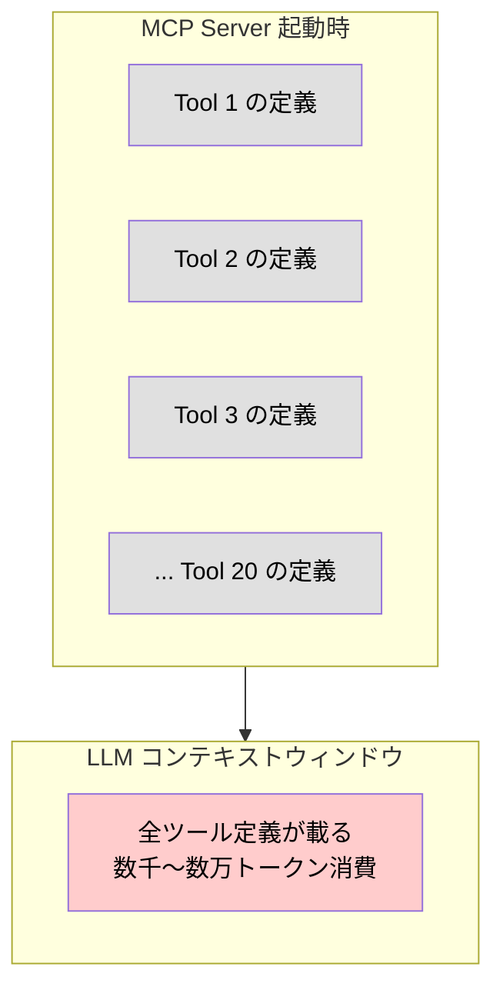

### 問題2: 中間データの重複通過

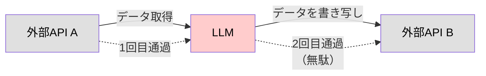

---

## 最適化手法一覧

### 1. コード実行方式（Anthropic提唱）

**概要**: LLMがツールを直接呼び出す代わりに、コードを書いて実行環境に処理を委譲する手法。

**従来方式**:

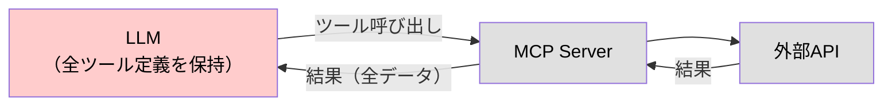

**改善後（コード実行方式）**:

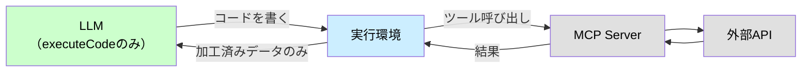

**実装例**:
```typescript
// LLMが生成するコード
import * as growi from './servers/growi';

const pages = await growi.getUserRecentPages({ id: 'user123' });
const titles = pages.map(p => p.title);
console.log(titles);  // 加工済みデータだけがLLMに返る
```

**効果**: トークン使用量 **98.7%削減**

**トレードオフ**:
- サンドボックス環境が必要
- セキュリティの考慮が必要
- インフラの複雑さが増す

**参考**: [Code execution with MCP - Anthropic](https://www.anthropic.com/engineering/code-execution-with-mcp)

---

### 2. セマンティックキャッシング

**概要**: 意味的に類似したリクエストに対して、キャッシュされた結果を再利用する手法。

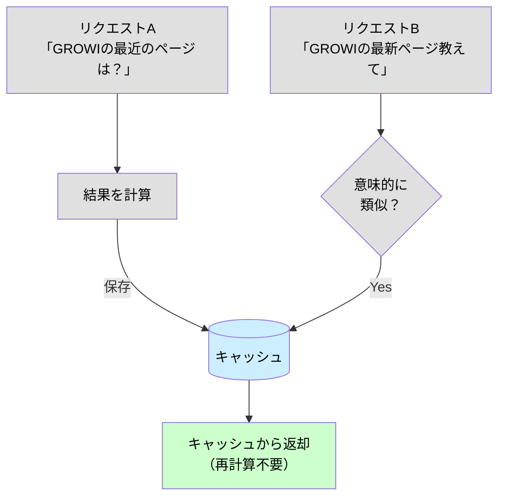

**実装アプローチ**:
- 埋め込みベクトルによる類似度計算
- 閾値を超えた類似度でキャッシュヒット判定
- TTL（有効期限）による鮮度管理

**効果**: **50-80%削減**（類似リクエストが多い場合）

---

### 3. コンテキスト圧縮

**概要**: コンテキストに含める情報を圧縮・要約して、トークン数を削減する手法。

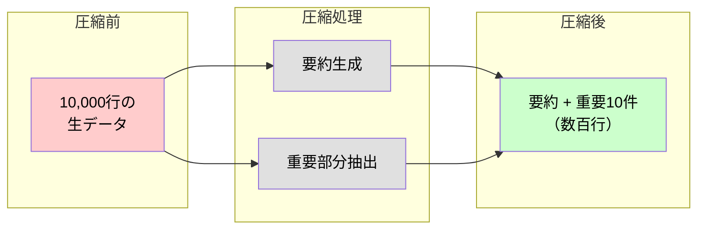

**手法の種類**:

| 手法 | 説明 | 適用場面 |
|------|------|----------|
| **抽出型要約** | 重要な文・段落をそのまま抜き出す | ドキュメント要約 |
| **抽象型要約** | 内容を短く言い換える | 長文の圧縮 |
| **階層的表現** | 詳細度を段階的に管理 | 複雑な構造データ |
| **チャンク化** | 大きなデータを分割して必要部分だけ使用 | 大規模データ処理 |

**実装例**:
```typescript
// 圧縮前: 10,000行のデータ
const allData = await fetchLargeDataset();

// 圧縮後: 要約 + 重要部分のみ
const compressed = {
  summary: "全10,000件のうち、未処理は150件",
  importantItems: allData.filter(d => d.priority === 'high').slice(0, 10)
};
```

**効果**: **30-60%削減**

---

### 4. 関連性スコアリング

**概要**: コンテキスト内の各情報に関連性スコアを付与し、低関連度の情報を優先的に削除する手法。

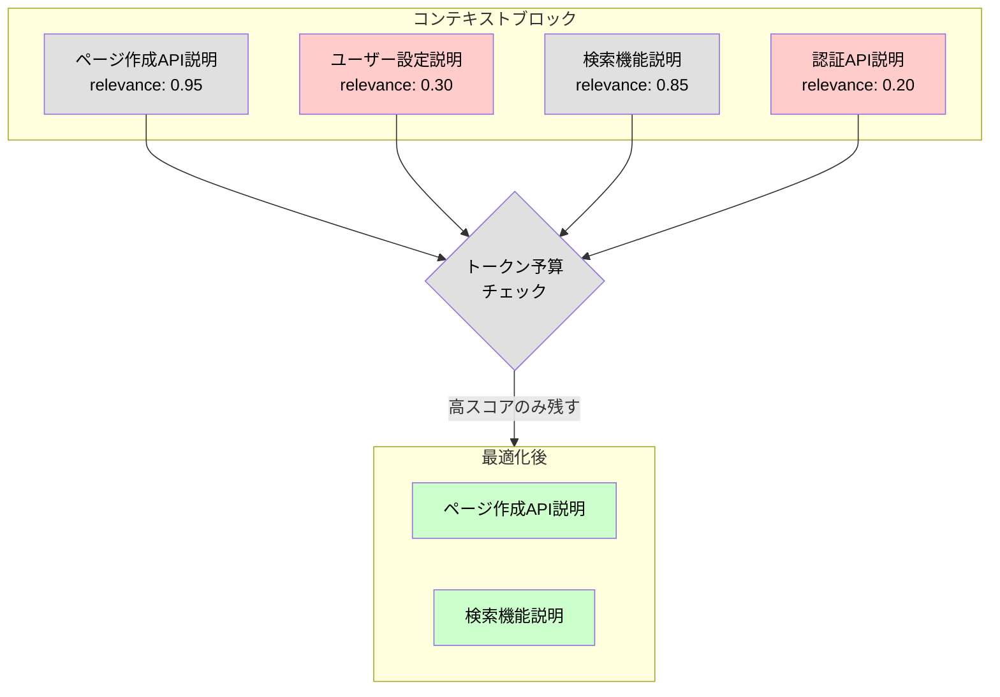

**スコアリング手法**:
- TF-IDFベクトル化 + コサイン類似度
- 埋め込みベクトルによるセマンティック類似度
- キーワードマッチングによる単純スコアリング

**効果**: **40-70%削減**

---

### 5. 時間ベース減衰（Time-based Decay）

**概要**: 古いコンテキスト情報の重要度を時間経過とともに低下させ、優先的に削除対象とする手法。

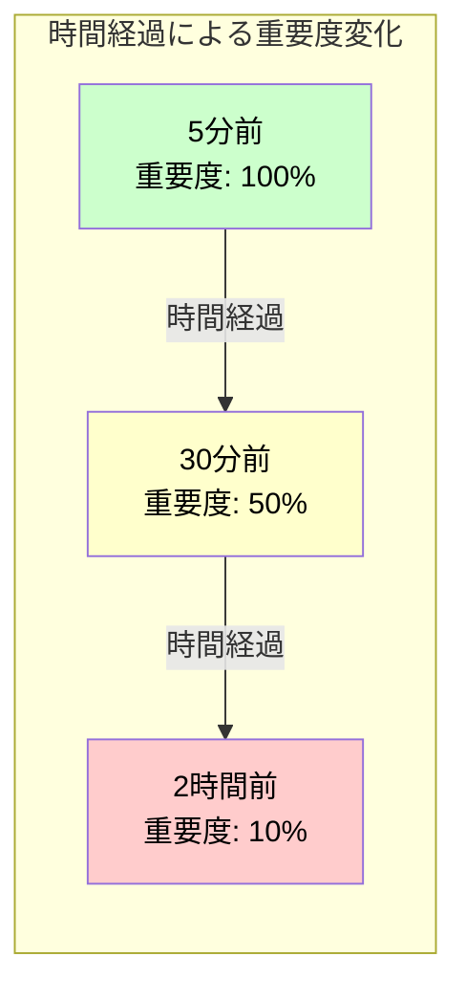

**数式**: `重要度 = 初期重要度 × e^(-λ × 経過時間)`

**適用場面**:
- マルチターン会話での履歴管理
- リアルタイムデータストリームの処理
- 長時間稼働するエージェント

**効果**: **20-40%削減**（長時間会話で効果大）

---

### 6. 遅延読み込み（Progressive Disclosure）

**概要**: 全ツール定義を最初に読み込むのではなく、必要になった時点で動的に読み込む手法。

**従来方式**:

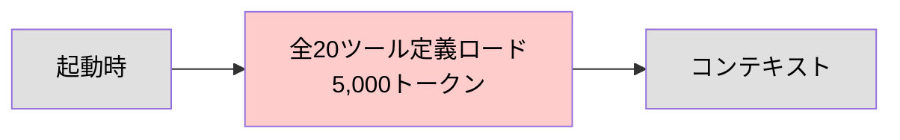

**改善後（遅延読み込み）**:

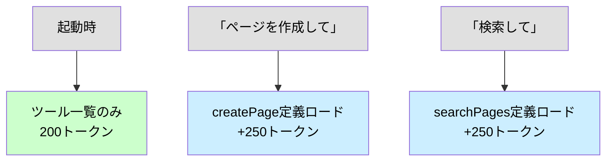

**実装アプローチ**:
- ツール定義をファイルシステム上に配置
- `search_tools` メタツールで必要なツールを検索
- 詳細レベルパラメータ（名前のみ / 説明付き / 完全定義）

**効果**: **90%以上削減**（ツール数が多いほど効果的）

---

### 7. コスト認識型ルーティング

**概要**: タスクの複雑さに応じて、適切なコストのモデルにルーティングする手法。

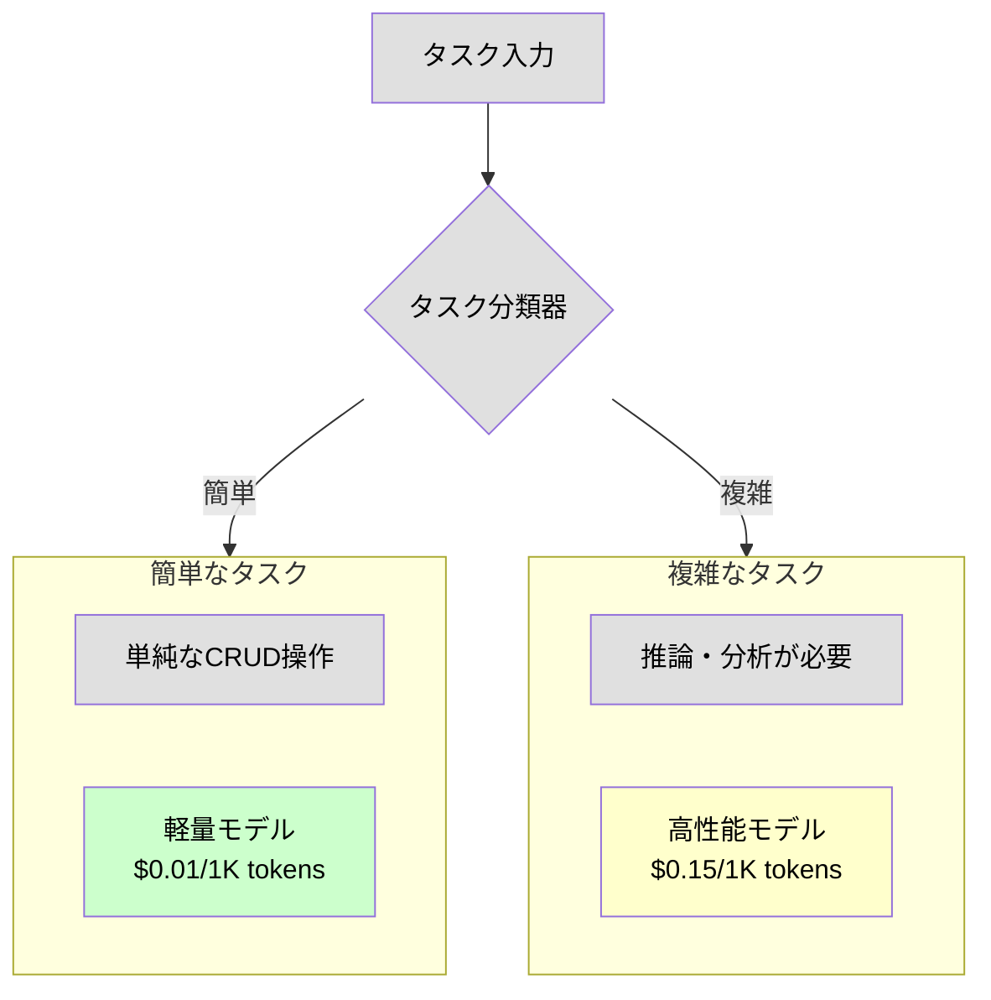

**分類基準の例**:
- 必要なツール数
- 推論ステップ数
- 出力の複雑さ

**効果**: **70-90%コスト削減**

---

### 8. リアルタイム最適化ループ

**概要**: バックグラウンドで継続的にコンテキストを監視・最適化する手法。

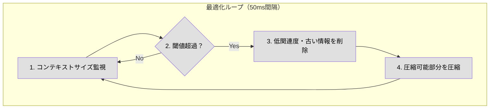

**効果**: 継続的なコンテキスト管理により、急激なトークン増加を防止

---

## 手法比較表

| 手法 | 削減効果 | 実装難易度 | 導入コスト | 最適な場面 |
|------|----------|------------|------------|------------|
| コード実行 | 98.7% | 高 | 高 | 複雑なワークフロー |
| セマンティックキャッシュ | 50-80% | 中 | 中 | 類似リクエストが多い |
| コンテキスト圧縮 | 30-60% | 低 | 低 | 大量データ処理 |
| 関連性スコアリング | 40-70% | 中 | 中 | 動的なコンテキスト管理 |
| 時間ベース減衰 | 20-40% | 低 | 低 | 長時間会話 |
| 遅延読み込み | 90%+ | 中 | 中 | ツール数が多い |
| コストルーティング | 70-90% | 中 | 中 | コスト最適化重視 |
| リアルタイム最適化 | 可変 | 高 | 高 | 長時間稼働エージェント |

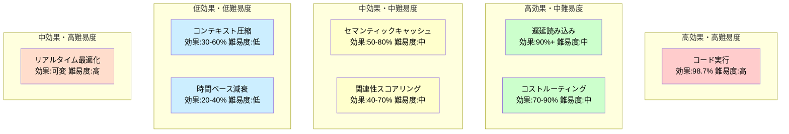

---

## 推奨される組み合わせ

### シナリオ1: ツール数が多いMCPサーバー

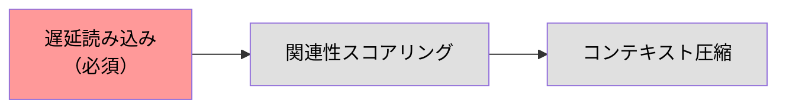

### シナリオ2: 大量データを扱うエージェント

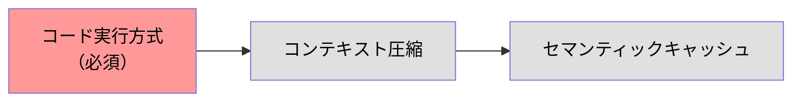

### シナリオ3: コスト最適化が重要な本番環境

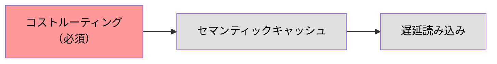

### シナリオ4: 長時間稼働する対話エージェント

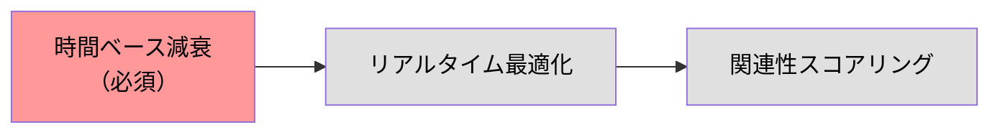

---

## 参考資料

- [Code execution with MCP: building more efficient AI agents - Anthropic](https://www.anthropic.com/engineering/code-execution-with-mcp)
- [MCP Token Optimization Strategies - Tetrate](https://tetrate.io/learn/ai/mcp/token-optimization-strategies)
- [Implementing Model Context Protocol in Autonomous Multi-Agent Systems - Subhadip Mitra](https://subhadipmitra.com/blog/2025/implementing-model-context-protocol/)
- [The Model Context Protocol's impact on 2025 - Thoughtworks](https://www.thoughtworks.com/en-us/insights/blog/generative-ai/model-context-protocol-mcp-impact-2025)
- [MCP Specification](https://modelcontextprotocol.io/specification/2025-11-25)

---

## 更新履歴

| 日付       | 内容                                   |
|------------|----------------------------------------|
| 2026-01-07 | 初版作成                               |
| 2026-01-07 | 図をMermaid形式に変更                  |
| 2026-01-08 | Mermaid全ノードにfill/color明示指定    |
