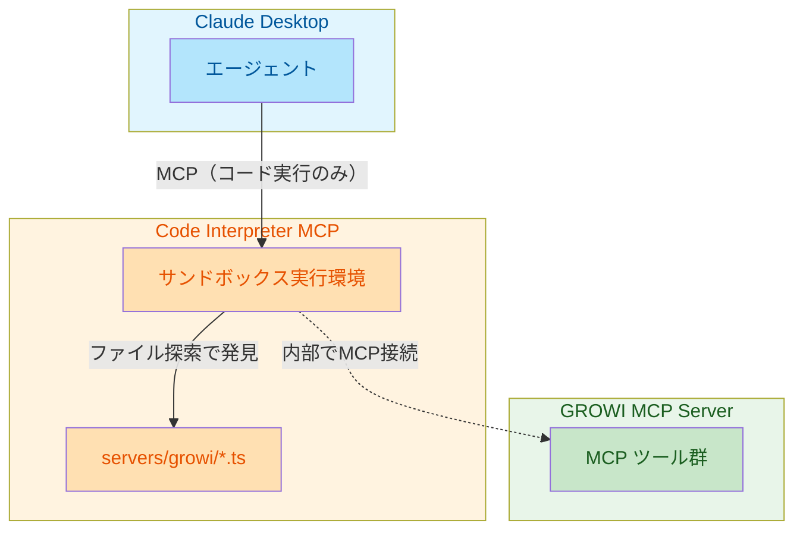
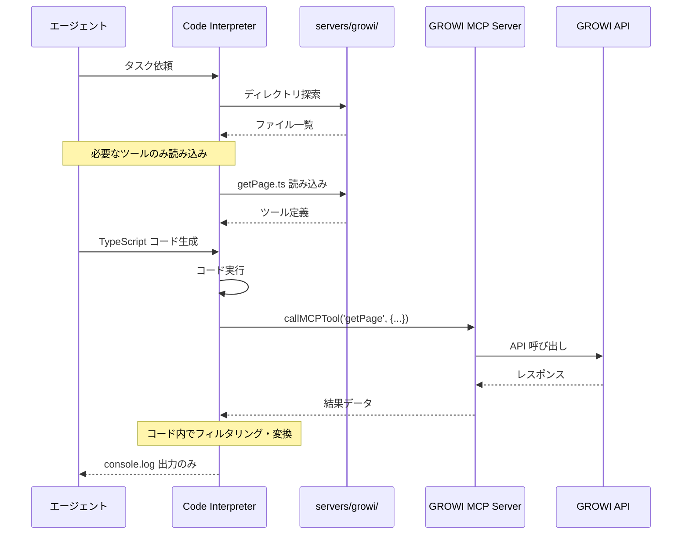

# MCP トークン最適化 - アーキテクチャ設計

*作成日: 2026年1月*

---

## 概要

本ドキュメントでは、Anthropic 提唱の「コード実行方式」を GROWI MCP Server に導入するためのアーキテクチャを定義する。

---

## システム構成

### 全体アーキテクチャ



**ポイント:** Claude Desktop は GROWI MCP に直接接続しない。Code Interpreter 内部で接続する。

---

## 処理フロー

### ツール発見から実行までの流れ



### 従来方式との比較

| 観点 | 従来方式 | コード実行方式（分離型） |
|------|----------|--------------------------|
| ツール定義 | 全22ツールを起動時にロード | 必要なツールのみオンデマンドで読み込み |
| ツール発見 | MCP `tools/list` | ファイルシステム探索 |
| ツール呼び出し | LLM が直接 MCP 経由で実行 | LLM がコードを書き、実行環境が実行 |
| 中間データ | すべて LLM を通過 | 実行環境内で処理、`console.log` のみ返却 |
| MCP 接続 | Claude Desktop → GROWI MCP | Code Interpreter → GROWI MCP |

---

## コンポーネント詳細

### 1. Code Interpreter MCP

外部の Code Interpreter MCP サーバーを導入する。

**役割:**

- TypeScript/JavaScript コードの実行
- サンドボックス環境の提供
- 外部モジュール（生成コードAPI）のインポート

**要件:**

- TypeScript/JavaScript 実行サポート
- 外部モジュールのインポート可否
- サンドボックス化（セキュリティ）
- Windows 対応

### 2. 生成コード API（servers/growi/）

GROWI MCP のツールを TypeScript 関数として提供する。

**ディレクトリ構造:**

```text
servers/
└── growi/
    ├── index.ts              # バレルエクスポート
    ├── client.ts             # MCP 接続ユーティリティ
    ├── page/
    │   ├── index.ts
    │   ├── getPage.ts
    │   ├── createPage.ts
    │   ├── updatePage.ts
    │   ├── deletePage.ts
    │   ├── searchPages.ts
    │   └── ...
    ├── revision/
    │   ├── index.ts
    │   ├── getRevision.ts
    │   └── listRevisions.ts
    ├── tag/
    │   └── ...
    ├── shareLinks/
    │   └── ...
    ├── comments/
    │   └── ...
    └── user/
        └── ...
```

**生成されるコード例:**

```typescript
// servers/growi/page/getPage.ts
import { callMCPTool } from "../client.js";

export interface GetPageInput {
  pageId?: string;
  path?: string;
  appName?: string;
}

export interface GetPageResponse {
  page: {
    _id: string;
    path: string;
    body: string;
    // ...
  };
}

/**
 * Get page data about the specific GROWI page
 * @category page
 * @tags read, single
 */
export async function getPage(input: GetPageInput): Promise<GetPageResponse> {
  return callMCPTool<GetPageResponse>('getPage', input);
}
```

### 3. GROWI MCP Server

既存の MCP ツール群を提供する。変更なし。

**役割:**

- GROWI API へのアクセス
- 認証・認可の管理
- レスポンスの整形

---

## エージェントの利用パターン

### パターン1: 単一ツール呼び出し

```typescript
import * as growi from './servers/growi';

const page = await growi.page.getPage({ path: '/docs/guide' });
console.log(page.page.body);
```

### パターン2: 複数ツールの連携（中間データがLLMを通過しない）

```typescript
import * as growi from './servers/growi';

// 検索して必要なデータだけ抽出
const results = await growi.page.searchPages({ query: 'MCP' });
const paths = results.data.slice(0, 5).map(p => p.path);
console.log(paths);  // これだけがLLMに返る
```

### パターン3: データ変換とフィルタリング

```typescript
import * as growi from './servers/growi';

// ページを取得して更新
const page = await growi.page.getPage({ path: '/docs/guide' });
await growi.page.updatePage({
  pageId: page.page._id,
  body: page.page.body + '\n\n## 追記\n新しい内容'
});
console.log('Updated');  // 成功メッセージのみLLMに返る
```

---

## セキュリティ考慮事項

### Code Interpreter のセキュリティ

| 項目 | 対策 |
|------|------|
| ファイルシステムアクセス | 作業ディレクトリに制限 |
| ネットワークアクセス | GROWI MCP への接続のみ許可 |
| リソース制限 | CPU、メモリ、実行時間の上限設定 |
| コード検証 | サンドボックス内での実行 |

### GROWI MCP のセキュリティ

既存のセキュリティ対策を維持:

- API キーによる認証
- HTTPS 通信
- 入力値のバリデーション

---

## 関連ドキュメント

| ドキュメント | 内容 |
|--------------|------|
| [decision.md](./decision.md) | 決定方針の概要 |
| [implementation-plan.md](./implementation-plan.md) | 実装計画（ストーリーとタスク） |

---

## 参考資料

- [Code execution with MCP: building more efficient AI agents - Anthropic](https://www.anthropic.com/engineering/code-execution-with-mcp)
