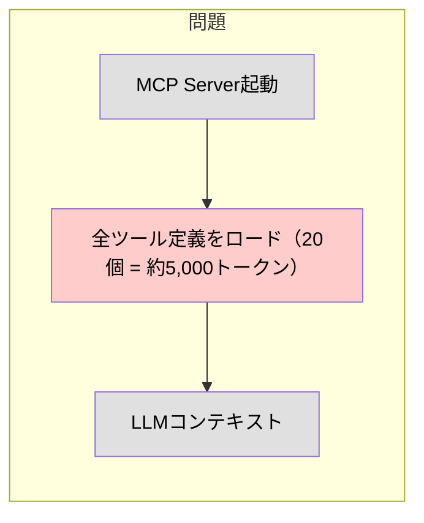
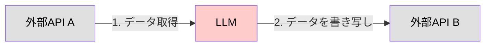
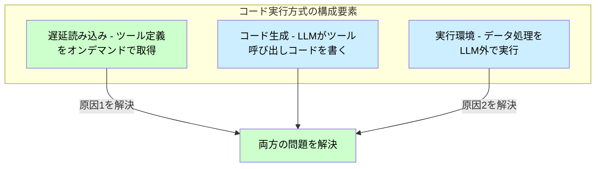
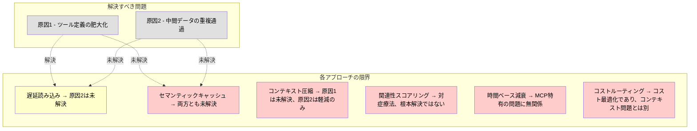
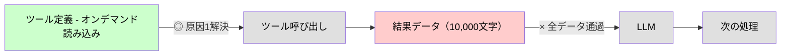
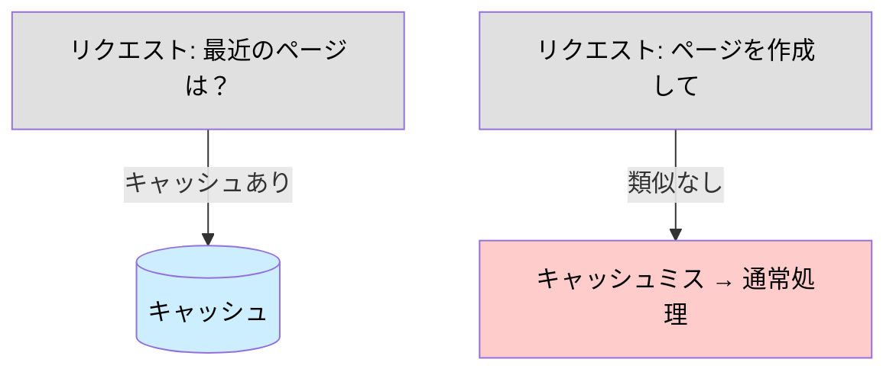
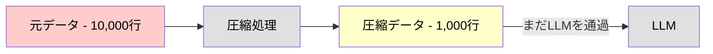
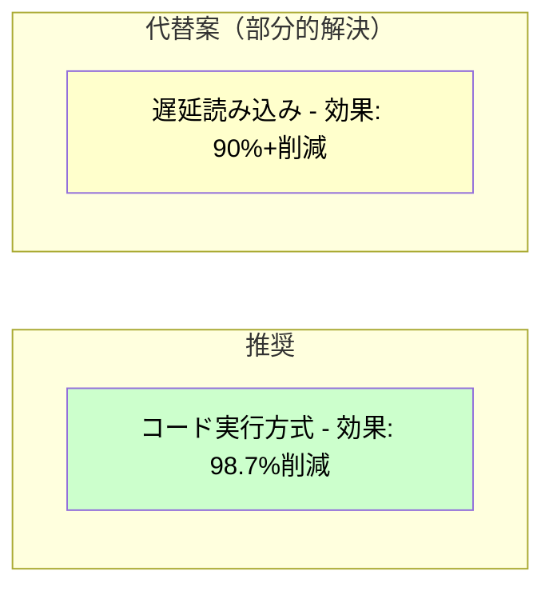
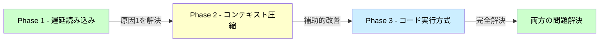

# MCP トークン最適化 調査サマリー

*作成日: 2026年1月7日*
*詳細ドキュメント: [mcp-token-optimization-techniques.md](./mcp-token-optimization-techniques.md)*

---

## 1. MCPのコンテキストを圧迫する原因

MCPでツールを多数接続すると、以下の **2つの原因** でコンテキストウィンドウが圧迫されます。

### 原因1: ツール定義の肥大化



- MCPクライアントは起動時に **全ツール定義** をコンテキストに読み込む
- ツール数が増えるほど、リクエスト処理前に消費するトークンが増加
- 数千ツールを接続すると、数十万トークンを消費する場合も

### 原因2: 中間データの重複通過



- ツール間でデータを受け渡す際、**同じデータがLLMを複数回通過**
- 例: Google Driveの文書をSalesforceに転送 → 文書全体が2回コンテキストを通る
- 大きなドキュメントではコンテキスト上限を超える可能性も

---

## 2. トークン消費削減手法の一覧

調査で特定した主要な最適化手法は以下の通りです。

| 手法 | 削減効果 | 実装難易度 | 概要 |
|------|----------|------------|------|
| **コード実行方式** | 98.7% | 高 | LLMがコードを書き、実行環境で処理 |
| **遅延読み込み** | 90%+ | 中 | ツール定義をオンデマンドで読み込み |
| **コストルーティング** | 70-90% | 中 | タスク複雑度に応じてモデルを選択 |
| **セマンティックキャッシュ** | 50-80% | 中 | 類似リクエストの結果を再利用 |
| **関連性スコアリング** | 40-70% | 中 | 低関連度の情報を優先削除 |
| **コンテキスト圧縮** | 30-60% | 低 | 要約・フィルタリングで圧縮 |
| **時間ベース減衰** | 20-40% | 低 | 古い情報の重要度を低下 |

---

## 3. コンテキスト圧迫をクリティカルに解決する方法

### 結論: コード実行方式（Anthropic提唱）

**両方の原因を根本から解決できる唯一のアプローチ**



### なぜコード実行方式が最も効果的か

| 観点 | 従来方式 | コード実行方式 |
|------|----------|----------------|
| ツール定義 | 全て事前ロード | **オンデマンド読み込み** |
| ツール呼び出し | LLMが直接実行 | **LLMはコードを書くだけ** |
| 中間データ | LLMを通過 | **実行環境内で完結** |
| 原因1（定義肥大化） | 未解決 | **解決** |
| 原因2（データ重複） | 未解決 | **解決** |

### 補足: 遅延読み込み単体との違い

「遅延読み込み」は「コード実行方式」の **一部** です。

```
コード実行方式 = 遅延読み込み + コード生成 + 実行環境
```

- **遅延読み込み単体**: 原因1のみ解決（定義の肥大化）
- **コード実行方式**: 原因1と原因2の両方を解決

### 他の手法では不十分な理由

各手法が「クリティカルな解決策」とならない理由を以下に示します。



- **遅延読み込み** [原因1: ◎ / 原因2: ×] - 中間データは依然としてLLMを通過。大量データ転送時にコンテキスト上限に達する可能性が残る
- **セマンティックキャッシュ** [原因1: × / 原因2: △] - 類似リクエストの再利用に過ぎない。新規リクエストや異なるパターンには効果がない
- **コンテキスト圧縮** [原因1: × / 原因2: △] - データを圧縮してもLLMを通過する構造は変わらない。情報損失のリスクもある
- **関連性スコアリング** [原因1: △ / 原因2: △] - 既にコンテキストに載った情報を削除する「対症療法」。問題の発生自体を防げない
- **時間ベース減衰** [原因1: × / 原因2: ×] - 長時間会話向けの手法。MCPのツール定義・データ転送問題とは直接関係がない
- **コストルーティング** [原因1: × / 原因2: ×] - モデル選択によるコスト最適化であり、コンテキスト消費量自体は変わらない

### 各手法の限界：詳細

#### 遅延読み込み



**限界**: ツール定義の読み込みは最適化されるが、**ツール実行結果は従来通りLLMを通過**する。10,000行のスプレッドシートを取得すれば、その全データがコンテキストに載る。

#### セマンティックキャッシュ



**限界**: **過去に類似リクエストがあった場合のみ有効**。新しいタスクや異なる操作パターンでは効果がない。また、ツール定義の肥大化問題には一切対処できない。

#### コンテキスト圧縮



**限界**: データ量は減るが、**LLMを通過する構造は変わらない**。また、圧縮による情報損失で精度が低下するリスクがある。ツール定義の肥大化問題には対処できない。

#### 関連性スコアリング

**限界**: コンテキストに載った情報を「後から削除」する手法。**問題が発生した後の対症療法**であり、そもそも不要な情報がコンテキストに載ること自体を防げない。

#### 時間ベース減衰

**限界**: 長時間の会話で古い情報を削除する手法。**MCPのツール定義や単発のデータ転送とは無関係**。マルチターン会話の履歴管理には有効だが、今回の問題の解決策にはならない。

#### コストルーティング

**限界**: タスクに応じて安いモデルを使う手法。**トークン消費量自体は変わらない**。コスト最適化であり、コンテキスト圧迫問題とは別の観点。

---

## 4. 結論: 推奨アプローチ

### 最も効果的なアプローチ: **コード実行方式**



| 項目 | 内容 |
|------|------|
| **推奨アプローチ** | コード実行方式（Anthropic提唱） |
| **効果** | トークン消費 98.7% 削減 |
| **解決する問題** | 原因1（定義肥大化）+ 原因2（データ重複）の両方 |
| **必要なもの** | サンドボックス実行環境、セキュリティ対策 |

### 段階的導入が現実的な場合

インフラ投資が難しい場合は、以下の段階的アプローチを推奨：



| Phase | アプローチ | 効果 | 解決する問題 |
|-------|------------|------|--------------|
| 1 | 遅延読み込み | 90%+ | 原因1のみ |
| 2 | コンテキスト圧縮 | +30-60% | 原因2を軽減 |
| 3 | コード実行方式 | 98.7% | 両方を完全解決 |

---

## 参考資料

- [Code execution with MCP: building more efficient AI agents - Anthropic](https://www.anthropic.com/engineering/code-execution-with-mcp)
- [MCP Token Optimization Strategies - Tetrate](https://tetrate.io/learn/ai/mcp/token-optimization-strategies)
- [MCP Specification](https://modelcontextprotocol.io/specification/2025-11-25)

---

## 関連ドキュメント

- [詳細調査ドキュメント](./mcp-token-optimization-techniques.md) - 各手法の詳細な解説
- [Anthropic記事の日本語訳](./code-execution-with-mcp.md) - コード実行方式の原文翻訳
