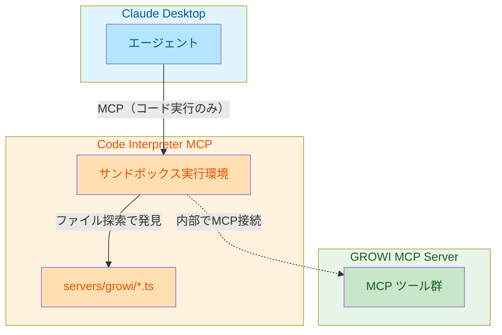

# MCP トークン最適化 - ストーリーとタスク

## 背景

Anthropic の記事「Code execution with MCP: Building more efficient agents」で指摘されている以下の問題に対応する。

1. **ツール定義がコンテキストウィンドウを圧迫する** - 全22ツールが起動時に読み込まれる
2. **中間結果がトークンを消費する** - 検索結果やページ本文がフィルタリングなしで返却される

参考: [docs/code-execution-with-mcp.md](./code-execution-with-mcp.md)

## 方針

**Anthropic提唱方式（コード実行環境）を採用する。**

- MCPツールを「直接呼び出し」ではなく「TypeScriptコードAPI」として提示
- エージェントがコードを書いてMCPサーバーとやり取り
- ファイルシステムを探索してツールを発見
- 実行環境でデータをフィルタリングしてからモデルに返す

## 前提条件

**利用環境:** Claude Desktop + MCP 連携

Claude Desktop 自体にはコード実行環境がないため、**Code Interpreter MCP サーバー**を追加で導入する。

## アーキテクチャ

**重要:** Anthropic 提唱アプローチでは、ツール発見に MCP の `tools/list` を使用しない。エージェントがファイルシステムを探索して必要なツールだけを読み込む。



**ポイント:** Claude Desktop は GROWI MCP に直接接続しない。Code Interpreter 内部で接続する。

**フロー:**

1. Claude Desktop がエージェントにタスクを依頼
2. エージェントが `servers/growi/` ディレクトリを探索（ファイル一覧取得）
3. 必要なツールファイル（例: `getPage.ts`）だけを読み込む
4. エージェントが TypeScript コードを生成
5. Code Interpreter MCP がコードを実行
6. コード内で `callMCPTool()` が GROWI MCP Server に接続・呼び出し
7. 結果をコード内でフィルタリング・変換
8. `console.log()` の出力だけが Claude Desktop に返る

**トークン削減のポイント:** 手順3で必要なツール定義だけを読み込むため、22ツール全ての定義をロードしない。

---

## Epic: MCP トークン効率の改善

### Story 1: コード実行環境を利用できる

**As a** Claude Desktop ユーザー
**I want** Code Interpreter MCP サーバーを導入したい
**So that** エージェントが生成したコードを実行し、トークン効率を改善できる

**受け入れ基準:**

- Code Interpreter MCP サーバーが Claude Desktop から利用可能
- TypeScript/JavaScript コードが実行できる
- 外部モジュール（生成されたコードAPI）をインポートできる
- 実行結果（console.log）が Claude Desktop に返る

#### タスク

| ID | タスク | 見積 |
|----|--------|------|
| 1-1 | Code Interpreter MCP サーバーの選定・調査 | M |
| 1-2 | Code Interpreter MCP サーバーの導入・設定 | M |
| 1-3 | Claude Desktop の MCP 設定更新 | S |
| 1-4 | 生成コードAPIの配置場所の決定 | S |
| 1-5 | 動作確認（簡単なコード実行テスト） | S |
| 1-6 | セキュリティ設定の確認・調整 | M |

#### Story 1 タスク詳細

##### 1-1: Code Interpreter MCP サーバーの選定・調査

**目的:** 要件を満たす Code Interpreter MCP サーバーを特定する

**作業内容:**

- 既存の Code Interpreter MCP サーバーを調査
  - [mcp-server-code-sandbox](https://github.com/anthropics/anthropic-quickstarts/tree/main/mcp-server-code-sandbox)
  - [code-interpreter-mcp](https://github.com/anthropics/anthropic-quickstarts)
  - その他コミュニティ製
- 要件との適合性を評価
  - TypeScript/JavaScript 実行サポート
  - 外部モジュールのインポート可否
  - サンドボックス化の程度
  - Windows 対応
- 選定理由をドキュメント化

**成果物:** 選定結果と理由を記載したドキュメント

---

##### 1-2: Code Interpreter MCP サーバーの導入・設定

**目的:** 選定したサーバーをローカル環境に導入する

**作業内容:**

- サーバーのインストール（npm/pnpm）
- 設定ファイルの作成
- 作業ディレクトリの設定（生成コードAPIへのアクセス用）
- 依存関係の解決

**成果物:**

- インストール済みの Code Interpreter MCP サーバー
- 設定ファイル

---

##### 1-3: Claude Desktop の MCP 設定更新

**目的:** Claude Desktop から Code Interpreter MCP を利用可能にする

**作業内容:**

- `claude_desktop_config.json` の編集
- Code Interpreter MCP サーバーの登録
- GROWI MCP サーバーとの共存設定
- Claude Desktop の再起動と接続確認

**成果物:** 更新された Claude Desktop 設定

---

##### 1-4: 生成コードAPIの配置場所の決定

**目的:** Code Interpreter から生成コードAPIにアクセスできるようにする

**作業内容:**

- Code Interpreter の作業ディレクトリを確認
- 生成コードAPIの配置パスを決定
- シンボリックリンクまたはコピーの方針決定
- パス解決の仕組みを設計

**成果物:** 配置方針のドキュメント

---

##### 1-5: 動作確認（簡単なコード実行テスト）

**目的:** 環境が正しく動作することを確認する

**作業内容:**

- 簡単な TypeScript コードの実行テスト
- `console.log()` の出力確認
- 外部モジュールのインポートテスト
- エラーハンドリングの確認

**成果物:** 動作確認チェックリスト

---

##### 1-6: セキュリティ設定の確認・調整

**目的:** 安全にコードを実行できる環境を確保する

**作業内容:**

- サンドボックス設定の確認
- ファイルシステムアクセス制限の設定
- ネットワークアクセス制限の確認
- リソース制限（CPU、メモリ、実行時間）の設定

**成果物:** セキュリティ設定ドキュメント

---

### Story 2: ツールをTypeScriptコードAPIとして利用できる

**As a** 開発者・エージェント
**I want** MCPツールをTypeScriptコードAPIとして利用したい
**So that** コード実行環境でツールを効率的に組み合わせ、トークン消費を大幅に削減できる

**受け入れ基準:**

- 各ツールがTypeScript関数としてエクスポートされる
- ファイルシステムベースでツールを発見できる（カテゴリ別ディレクトリ構造）
- 型定義が自動生成される
- エージェントがコード内でデータをフィルタリング・変換できる

**期待される効果:**

- トークン使用量を最大98%削減（Anthropic記事の実績値）
- 必要なツール定義だけをオンデマンドで読み込み
- 中間結果がモデルを通過せずに処理可能

#### タスク

| ID | タスク | 見積 |
|----|--------|------|
| 2-1 | コードAPI生成の設計ドキュメント作成 | M |
| 2-2 | ファイルシステム構造の設計（カテゴリ別ディレクトリ） | M |
| 2-3 | Zodスキーマから TypeScript インターフェース生成 | L |
| 2-4 | ツールごとの関数ラッパー生成 | L |
| 2-5 | `servers/growi/` ディレクトリ構造の生成 | M |
| 2-6 | index.ts（バレルエクスポート）の自動生成 | M |
| 2-7 | 各ツールファイルに JSDoc コメント追加（ツール発見用） | S |
| 2-8 | サンプルコードと使用ガイドの作成 | M |
| 2-9 | 統合テストの作成 | L |

#### Story 2 タスク詳細

##### 2-1: コードAPI生成の設計ドキュメント作成

**目的:** 実装前にアーキテクチャを明確化し、チーム内で合意を得る

**作業内容:**

- コード生成の全体フローを図示
- 入力（既存のZodスキーマ、ツール定義）と出力（生成されるファイル群）の定義
- 生成タイミングの決定（ビルド時 or 手動実行）
- 依存ライブラリの選定（`zod-to-ts`、`ts-morph` など）
- エラーハンドリング方針の決定

**成果物:** `docs/code-api-generation-design.md`

---

##### 2-2: ファイルシステム構造の設計（カテゴリ別ディレクトリ）

**目的:** エージェントがツールを発見しやすいディレクトリ構造を設計

**作業内容:**

- 既存の `src/tools/` 構造を分析し、カテゴリを決定
- 生成先ディレクトリの決定（`generated/servers/growi/` など）
- 各ディレクトリに配置するファイルの命名規則を決定
- `client.ts`（MCP呼び出しラッパー）の配置場所を決定
- SKILL.md ファイルの配置と内容を設計

**成果物:** 設計ドキュメント内のディレクトリ構造セクション

---

##### 2-3: Zodスキーマから TypeScript インターフェース生成

**目的:** 既存のZodスキーマから型安全なインターフェースを自動生成

**作業内容:**

- `src/tools/*/schema.ts` からZodスキーマを読み込む処理を実装
- `zod-to-ts` または同等のライブラリを使用して TypeScript 型を生成
- 入力型（`*Input`）と出力型（`*Response`）を生成
- オプショナルなフィールドの正しい型付け
- 生成された型をファイルに書き出す処理

**成果物:**

- `scripts/generate-types.ts`（生成スクリプト）
- 生成された `*.d.ts` または インターフェース定義

---

##### 2-4: ツールごとの関数ラッパー生成

**目的:** 各MCPツールをTypeScript関数として呼び出せるようにする

**作業内容:**

- ツール定義（名前、説明、パラメータ）を読み込む処理
- 関数テンプレートの作成
- `callMCPTool<T>()` を呼び出すラッパー関数の生成
- async/await 対応
- エラーハンドリングの統一（MCPエラーをTypeScriptエラーに変換）

**成果物:**

- `scripts/generate-functions.ts`（生成スクリプト）
- 生成された `getPage.ts`, `searchPages.ts` などの関数ファイル

---

##### 2-5: `servers/growi/` ディレクトリ構造の生成

**目的:** 設計したディレクトリ構造を実際に生成する

**作業内容:**

- カテゴリ別ディレクトリの作成（`page/`, `revision/`, `tag/` など）
- 1-3 と 1-4 で生成したファイルを適切な場所に配置
- `client.ts`（MCP接続・呼び出しユーティリティ）の実装
- 生成スクリプトの統合（`npm run generate` で一括実行）

**成果物:**

- `generated/servers/growi/` ディレクトリ一式
- `scripts/generate-all.ts`（統合生成スクリプト）

---

##### 2-6: index.ts（バレルエクスポート）の自動生成

**目的:** `import * as growi from './servers/growi'` で全ツールにアクセス可能にする

**作業内容:**

- 各カテゴリの `index.ts` を生成（`page/index.ts` など）
- ルートの `index.ts` を生成（全カテゴリを re-export）
- 名前衝突の回避（同名関数がある場合の対処）
- Tree-shaking に対応したエクスポート形式

**成果物:**

- 各ディレクトリの `index.ts`
- `generated/servers/growi/index.ts`

---

##### 2-7: 各ツールファイルに JSDoc コメント追加（ツール発見用）

**目的:** エージェントがファイルを読んだときにツールの用途を理解できるようにする

**作業内容:**

- 既存ツールの `description` を JSDoc コメントとして追加
- `@category`, `@tags`, `@example` などのタグを追加
- パラメータの説明を `@param` タグで追加
- 戻り値の説明を `@returns` タグで追加

**成果物:** JSDoc コメント付きの関数ファイル

---

##### 2-8: サンプルコードと使用ガイドの作成

**目的:** 開発者・エージェントが生成されたAPIを正しく使えるようにする

**作業内容:**

- 基本的な使用例（単一ツール呼び出し）
- 複数ツールの連携例（検索 → 取得 → 更新）
- フィルタリング・データ変換の例
- エラーハンドリングの例
- SKILL.md ファイルの作成（Claude Code Skills 形式）

**成果物:**

- `docs/code-api-usage-guide.md`
- `generated/servers/growi/SKILL.md`
- `examples/` ディレクトリにサンプルコード

---

##### 2-9: 統合テストの作成

**目的:** 生成されたコードAPIが正しく動作することを検証

**作業内容:**

- 生成スクリプトのユニットテスト
- 生成されたファイルの構文チェックテスト
- 型チェックテスト（`tsc --noEmit`）
- 実際のMCPサーバーとの接続テスト（モック or 実環境）
- E2Eテスト（エージェントが生成コードを使用するシナリオ）

**成果物:**

- `tests/code-api/` ディレクトリにテストファイル
- CI設定の更新

---

#### 生成されるディレクトリ構造（イメージ）

```text
servers/
└── growi/
    ├── index.ts              # バレルエクスポート
    ├── page/
    │   ├── index.ts
    │   ├── getPage.ts        # getPage 関数
    │   ├── createPage.ts
    │   ├── updatePage.ts
    │   ├── deletePage.ts
    │   ├── searchPages.ts
    │   └── ...
    ├── revision/
    │   ├── index.ts
    │   ├── getRevision.ts
    │   └── listRevisions.ts
    ├── tag/
    │   └── ...
    ├── shareLinks/
    │   └── ...
    ├── comments/
    │   └── ...
    └── user/
        └── ...
```

#### 生成されるコードの例

```typescript
// servers/growi/page/getPage.ts
import { callMCPTool } from "../../client.js";

export interface GetPageInput {
  pageId?: string;
  path?: string;
  appName?: string;
}

export interface GetPageResponse {
  page: {
    _id: string;
    path: string;
    body: string;
    // ...
  };
}

/**
 * Get page data about the specific GROWI page
 * @category page
 * @tags read, single
 */
export async function getPage(input: GetPageInput): Promise<GetPageResponse> {
  return callMCPTool<GetPageResponse>('getPage', input);
}
```

#### エージェントの利用例

```typescript
// エージェントが生成するコード例
import * as growi from './servers/growi';

// 検索して必要なデータだけ抽出（フィルタリングはコード内で実行）
const results = await growi.page.searchPages({ query: 'MCP' });
const paths = results.data.slice(0, 5).map(p => p.path);
console.log(paths);  // これだけがモデルに返る

// 複数操作の連鎖（中間結果はモデルを通過しない）
const page = await growi.page.getPage({ path: '/docs/guide' });
await growi.page.updatePage({
  pageId: page.page._id,
  body: page.page.body + '\n\n## 追記\n新しい内容'
});
console.log('Updated');
```

---

### Story 3: 大量データを分割して段階的に取得できる（オプショナル）

**As a** MCP クライアント利用者
**I want** 大量のデータを分割して取得できる
**So that** コード実行と組み合わせて、より効率的にデータを処理できる

**受け入れ基準:**

- すべてのリスト系ツールでページネーションが利用可能
- 次ページの有無がレスポンスに含まれる
- カーソルベースのページネーションをサポート

**備考:**

- コード実行環境では、ループ処理でページを順次取得できるため必須ではない
- ただし、サーバー側でページ分割することで、より効率的な処理が可能
- Story 2 完了後に検討

#### タスク

| ID | タスク | 見積 |
|----|--------|------|
| 3-1 | 共通ページネーションスキーマの作成（`offset`, `limit`, `cursor`） | S |
| 3-2 | `getRecentPages` のページネーション強化 | M |
| 3-3 | `searchPages` のページネーション強化 | M |
| 3-4 | `getPageListingChildren` のページネーション強化 | M |
| 3-5 | レスポンスに `hasMore`, `nextCursor`, `totalCount` を追加 | M |
| 3-6 | ページネーション統合テストの追加 | M |

#### Story 3 タスク詳細

##### 3-1: 共通ページネーションスキーマの作成

**目的:** 全リスト系ツールで一貫したページネーションパラメータを提供

**作業内容:**

- `src/tools/commons/pagination-schema.ts` を作成
- `offset`（オフセットベース）と `cursor`（カーソルベース）の両方をサポート
- `limit` パラメータのデフォルト値と最大値を定義
- 既存ツールのスキーマに組み込みやすい形式で設計

**成果物:**

```typescript
// src/tools/commons/pagination-schema.ts
export const paginationSchema = z.object({
  limit: z.number().min(1).max(100).default(20),
  offset: z.number().min(0).optional(),
  cursor: z.string().optional(),
});
```

---

##### 3-2: `getRecentPages` のページネーション強化

**目的:** 最近更新されたページを効率的に分割取得可能にする

**作業内容:**

- `getRecentPages` のスキーマに `paginationSchema` を追加
- GROWI API のページネーションパラメータとのマッピング
- レスポンスに `hasMore`, `nextCursor` を追加
- 既存の動作との後方互換性を維持

**成果物:** 更新された `src/tools/page/getRecentPages/`

---

##### 3-3: `searchPages` のページネーション強化

**目的:** 検索結果を効率的に分割取得可能にする

**作業内容:**

- `searchPages` のスキーマに `paginationSchema` を追加
- Elasticsearch のページネーション（`from`, `size`）とのマッピング
- 検索ヒット総数（`totalCount`）をレスポンスに追加
- スクロールAPI対応の検討（大量結果の場合）

**成果物:** 更新された `src/tools/page/searchPages/`

---

##### 3-4: `getPageListingChildren` のページネーション強化

**目的:** 子ページ一覧を効率的に分割取得可能にする

**作業内容:**

- `getPageListingChildren` のスキーマに `paginationSchema` を追加
- GROWI API のページネーションパラメータとのマッピング
- 深い階層の子ページがある場合の動作確認

**成果物:** 更新された `src/tools/page/getPageListingChildren/`

---

##### 3-5: レスポンスに `hasMore`, `nextCursor`, `totalCount` を追加

**目的:** クライアントが次ページの有無と総件数を把握できるようにする

**作業内容:**

- 共通レスポンス型 `PaginatedResponse<T>` を定義
- 各ツールのレスポンスをラップする形式に変更
- `nextCursor` の生成ロジック実装（オフセットベースの場合はエンコード）
- `totalCount` が取得できない場合の対処（`null` または省略）

**成果物:**

```typescript
// 共通レスポンス型
export interface PaginatedResponse<T> {
  data: T[];
  pagination: {
    hasMore: boolean;
    nextCursor?: string;
    totalCount?: number;
  };
}
```

---

##### 3-6: ページネーション統合テストの追加

**目的:** ページネーションが正しく動作することを検証

**作業内容:**

- 各ツールのページネーション動作テスト
- 境界値テスト（0件、1件、最大件数）
- カーソルの継続性テスト（複数ページを順次取得）
- 後方互換性テスト（パラメータなしでも動作）

**成果物:** `tests/pagination/` ディレクトリにテストファイル

---

#### コード実行との組み合わせ例

```typescript
// ページネーションを活用した効率的なデータ取得
import * as growi from './servers/growi';

let cursor: string | undefined;
const allPaths: string[] = [];

do {
  const result = await growi.page.getRecentPages({
    limit: 100,
    cursor
  });
  allPaths.push(...result.pages.map(p => p.path));
  cursor = result.hasMore ? result.nextCursor : undefined;
} while (cursor);

console.log(`Total: ${allPaths.length} pages`);
```

---

## 優先度と推奨順序

```text
必須（Anthropic提唱方式の実現）
├── Story 1: コード実行環境を利用できる
└── Story 2: ツールをTypeScriptコードAPIとして利用できる

オプショナル（補完的改善）
└── Story 3: 大量データを分割して段階的に取得できる
```

### 推奨アプローチ

1. **Phase 1**: Story 1 を完了させる
   - Code Interpreter MCP サーバーの選定・導入
   - Claude Desktop の MCP 設定更新
   - 動作確認とセキュリティ設定

2. **Phase 2**: Story 2 を完了させる
   - コードAPI生成の仕組みを構築
   - ファイルシステム構造の生成
   - サンプルコードと使用ガイドの作成

3. **Phase 3**: Story 3 を検討（オプショナル）
   - Story 2 の運用を通じて必要性を評価
   - 必要であればページネーション強化を実施

---

## 見積の目安

| サイズ | 目安 |
|--------|------|
| S | 0.5-1日 |
| M | 1-2日 |
| L | 3-5日 |

### 各ストーリーの見積

| ストーリー                                             | タスク数 | 総見積                         |
|--------------------------------------------------------|----------|--------------------------------|
| Story 1: コード実行環境を利用できる                    | 6        | 約 1週間（M×4 + S×2）          |
| Story 2: ツールをTypeScriptコードAPIとして利用できる   | 9        | 約 2-3週間（L×3 + M×5 + S×1）  |
| Story 3: 大量データを分割して段階的に取得できる        | 6        | 約 1週間（M×5 + S×1）          |

**必須ストーリー（Story 1 + Story 2）の総見積:** 約 3-4週間

---

## 参考リンク

- [Anthropic: Code execution with MCP](https://www.anthropic.com/engineering/code-execution-with-mcp)
- [Cloudflare: Code Mode](https://blog.cloudflare.com/)
- [MCP Community](https://github.com/modelcontextprotocol)
- [Claude Code Skills](https://docs.anthropic.com/en/docs/claude-code/skills)
